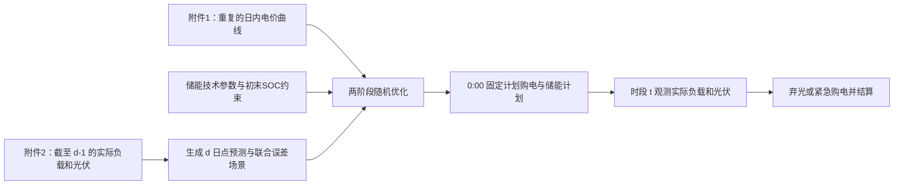

# 问题二：日前计划购电与紧急购电策略建模

## 1. 问题定位与建模边界

每天的分时电价曲线相同，但负载和光伏出力会随日期、时段及天气变化。在每天 0:00，微网只能依据此前历史数据制定当天的计划购电功率和储能充、放电计划。若实际运行时可用电力不足以覆盖负载，则在该时段向外网紧急购电，紧急电价为正常交易电价的 5 倍。

本模型采用以下边界，与问题一保持一致：

1. 日内划分为 144 个十分钟时段，令 $t\in\mathcal T=\{1,\ldots,144\}$，$\Delta t=1/6\ \mathrm h$。表中 `00:10` 表示 $00{:}00$--$00{:}10$ 时段，`0:00+1` 表示 $23{:}50$--$24{:}00$ 时段。
2. 不向外网售电；无法消纳的光伏允许弃光。
3. 计划购电量按计划全额结算；实际未取用的计划电量仍产生计划购电费用。这正是“除紧急购电外，其他购电费用按计划购电量计算”的含义。
4. 问题二的基准模型在 0:00 同时确定计划购电和储能充、放电计划。实时阶段只允许弃光、少取用已计划的电力，以及紧急购电；不允许事后重新安排储能计划。这样不会把当天未来的实际信息提前用于决策。问题三再允许在 6:00、12:00、18:00 更新计划。
5. 并网点最大购电功率记为 $P^{buy,\max}$。题目没有给出其数值，因此模型中保留该参数，数值计算时不能擅自将其设为储能最大功率 $5000\ \mathrm{kW}$。

## 2. 附件 2 的数据作用与整理结果

### 2.1 数据清洗与结构

附件 2 提供 2025-01-01 至 2025-12-31 共 365 天的实际运行轨迹，包含两个工作表：`小区负载` 和 `光伏发电实际功率`。每张表均为 $365\times145$：第一列为日期，后 144 列为十分钟功率。

已核对的数据质量如下：

| 项目 | 小区负载 | 光伏实际功率 |
|---|---:|---:|
| 日期范围 | 2025-01-01 至 2025-12-31 | 2025-01-01 至 2025-12-31 |
| 日期是否一一对应 | 是 | 是 |
| 缺失值 | 0 | 0 |
| 负值 | 0 | 0 |
| 功率范围 | 1995.7176--7978.8849 kW | 0--10216.2 kW |

因此不需要插补或删除异常行。建模前只需完成以下整理：

1. 将宽表转换为以“日期、时段”为索引的 $365\times144$ 功率矩阵；
2. 将时间列统一解释为时段终点；
3. 添加星期几、月份和是否节假日等日历特征；
4. 每天 $d$ 的预测和场景只能由日期小于 $d$ 的数据生成，严禁使用当天实际曲线。

附件 1 中的分时电价记为 $c_t$（元/kWh），并在每个日历日重复使用，即 $c_{d,t}=c_t$。

### 2.2 附件 2 在滚动决策中的三种角色

附件 2 的数据可以视为真实运行数据，但不能把待决策日的整条实际曲线直接交给当天 0:00 的优化器。对任一待决策日 $d$，同一份数据应按时间边界承担三种不同角色：

1. 日期 $h<d$ 的数据是已知历史，可用于训练预测器、计算预测误差和生成场景；
2. 日期 $d$ 的数据在 0:00 制定计划时必须隐藏，不得用于构造当天的计划购电量和储能计划；
3. 当 $B_{d,t}$、$C_{d,t}$、$D_{d,t}$ 已经锁定后，日期 $d$ 的实际数据才逐时段揭示，用于计算紧急购电、弃光、未取用计划电量和实际费用，并在当天结束后加入历史集。

如果当天实际负载和实际光伏在优化前已经完全已知，且计划购电没有起作用的并网容量上限，那么最优解中的紧急购电必然为零。设某时段 $R_{d,t}>0$，取任意 $0<\epsilon\le R_{d,t}$，作替换

$$
B_{d,t}'=B_{d,t}+\epsilon,
\qquad
R_{d,t}'=R_{d,t}-\epsilon.
$$

该替换保持功率平衡不变，而费用变化为

$$
\Delta C
=c_t\epsilon\Delta t-5c_t\epsilon\Delta t
=-4c_t\epsilon\Delta t<0.
$$

因此，存在 $R_{d,t}>0$ 与最优性矛盾。问题不在于附件 2 是否属于真实数据，而在于未来真实数据不能进入事前决策。正确做法是用历史部分进行预测，用当天部分进行计划锁定后的样本外回测。

## 3. 日前预测与不确定性场景

### 3.1 可在 0:00 获得的信息

对待决策日 $d$，定义已知历史集

$$
\mathcal H_d=\{h:h<d\}.
$$

在 0:00，能够获得历史实际负载 $L_{h,t}$、历史实际光伏功率 $G_{h,t}$、当天的日历信息以及电价 $c_t$，但不能获得 $L_{d,t}$ 和 $G_{d,t}$。据此构造点预测 $\widehat L_{d,t}$ 和 $\widehat G_{d,t}$。

### 3.2 光伏指数加权与局部趋势预测

光伏预测必须保留完整的 144 时段日内曲线。对每个十分钟时段 $t$，使用最近 $K_G=14$ 天相同时段的历史功率构造指数加权水平项：

$$
\widetilde G_{d,t}
=\sum_{k=1}^{K_G}w_k^G G_{d-k,t},
\qquad
w_k^G
=\frac{\rho_G^{k-1}}{\sum_{j=1}^{K_G}\rho_G^{j-1}},
\qquad 0<\rho_G<1.
$$

其中 $k=1$ 表示前一日，较近日期具有较高权重。为反映季节性上升或下降趋势，对每个时段执行指数加权局部线性拟合：

$$
(\widehat a_{d,t},\widehat b_{d,t})
=\arg\min_{a,b}
\sum_{k=1}^{K_G}w_k^G
\left[G_{d-k,t}-(a-bk)\right]^2.
$$

在上述拟合中，$a$ 是局部趋势外推到待预测日 $d$ 的功率，$b$ 描述功率随日期向前推进的局部变化。为避免单日天气波动使线性外推过度，使用参数 $\beta$ 在指数加权水平项与趋势外推项之间收缩：

$$
\widehat G_{d,t}
=\max\left\{
0,
(1-\beta)\widetilde G_{d,t}
+\beta\widehat a_{d,t}
\right\},
\qquad 0\le\beta\le1.
$$

$\beta=0$ 时只保留近期加权水平，$\beta=1$ 时完全采用局部趋势外推。建议先取 $\rho_G=0.9$、$\beta=0.5$，再在严格遵守时间顺序的滚动验证中调整。若存在光伏逆变器或电站额定功率 $G^{\max}$，还应执行

$$
\widehat G_{d,t}
\leftarrow
\min\left\{G^{\max},\widehat G_{d,t}\right\}.
$$

夜间历史光伏功率均为零时，预测自然保持为零。后续若获得气象数值预报、云量或辐照度，可以替换上述点预测器，优化模型的场景和调度结构不需要改变。

### 3.3 负载的同星期滚动预测

负载具有工作日、周末和节假日规律，使用最近 $K_L=4$ 个相同星期几的历史日进行指数加权：

$$
\widehat L_{d,t}
=\sum_{k=1}^{K_L}w_k^L L_{d-7k,t},
\qquad
w_k^L
=\frac{\rho_L^{k-1}}{\sum_{j=1}^{K_L}\rho_L^{j-1}},
\qquad K_L=4.
$$

其中 $k=1$ 表示最近一个相同星期几。若日 $d$ 是法定节假日，应优先从此前节假日或相似休息日中选样；历史样本不足时使用已有同类日期，仍不足时再退化为最近可用日的同一时段值。所有降级规则只能使用 $h<d$ 的数据。

### 3.4 负载—光伏联合误差场景

仅用点预测制定计划，会低估“高负载且低光伏”同时发生时的紧急购电风险。因此用成对的负载、光伏残差构造联合场景，而不分别随机抽取两类误差。

对历史日 $h$，先按当时可获得的数据生成因果预测 $\widehat L_{h,t}$、$\widehat G_{h,t}$，再计算整日误差轨迹：

$$
\varepsilon^L_{h,t}=L_{h,t}-\widehat L_{h,t},
\qquad
\varepsilon^G_{h,t}=G_{h,t}-\widehat G_{h,t}.
$$

在有足够因果预测残差后，选取最近 $M$ 个可用误差日作为场景集 $\Omega_d$，例如 $M=20$，并令 $\omega$ 对应其中一个历史误差日 $h(\omega)$。则待决策日的情景轨迹为

$$
L_{d,t}^{\omega}=\max\left\{0,\widehat L_{d,t}+\varepsilon^L_{h(\omega),t}\right\},
$$

$$
G_{d,t}^{\omega}=\max\left\{0,\widehat G_{d,t}+\varepsilon^G_{h(\omega),t}\right\}.
$$

可取等概率 $p_\omega=1/M$，也可对较近样本赋予较高概率。保留同一历史日的整条误差轨迹，可以同时保留日内相关性、负载与光伏之间的相关性，以及连续阴天或连续高负载等风险形态。

题目要求从 2025-02-01 起给出完整策略，不能因为残差样本尚少而跳过 2 月前半月。为此采用以下暖启动规则：对 2025-02-01 起的每个日 $d$，从此前最近的 $M$ 个实际日中选取场景样本；若尚不足 $M$ 天，则使用全部此前可用日。设这些样本的逐时段均值为 $\overline L_{d,t}$、$\overline G_{d,t}$，用

$$
\varepsilon^L_{h,t}=L_{h,t}-\overline L_{d,t},
\qquad
\varepsilon^G_{h,t}=G_{h,t}-\overline G_{d,t}
$$

代替上述因果预测残差，并仍代入场景公式。这样 2025-02-01 的场景只使用 2025 年 1 月数据，完整满足 0:00 的信息边界。积累到足够的因果预测残差后，切换为上文更精确的残差场景；两种规则均不得使用日期 $d$ 的实际值。

### 3.5 五倍紧急电价对应的决策分位数

点预测给出的是中心位置，但中心预测不等于经济意义下的最优计划。为说明五倍紧急电价的作用，暂时忽略储能的跨时段耦合，令时段 $t$ 的随机净需求为

$$
X_{d,t}=L_{d,t}-G_{d,t}+C_{d,t}-D_{d,t}.
$$

若计划购电为 $B_{d,t}$，未被计划覆盖的正缺口需要紧急购电，则该时段的期望费用为

$$
J(B_{d,t})
=c_tB_{d,t}
+5c_t\mathbb E\left[(X_{d,t}-B_{d,t})^+\right],
$$

其中

$$
[x]^+=\max\{x,0\}.
$$

在分布连续且最优点位于内部时，一阶条件为

$$
\frac{\partial J}{\partial B_{d,t}}
=c_t-5c_t\Pr(X_{d,t}>B_{d,t})=0.
$$

因此

$$
\Pr(X_{d,t}>B_{d,t}^{*})=0.2,
\qquad
F_{X_{d,t}}(B_{d,t}^{*})=0.8,
$$

即

$$
B_{d,t}^{*}=F_{X_{d,t}}^{-1}(0.8).
$$

这说明在简化的单时段模型中，最优计划大致对应净需求的条件 $80\%$ 分位数，而不是条件均值。储能使各时段通过 SOC 方程相互耦合，因此不能逐时段机械套用 $80\%$ 分位数；应由后文的联合场景两阶段随机 MILP 统一确定计划购电和储能计划。

### 3.6 参数确定与预测检验

建议使用 $K_G=14$、$\rho_G=0.9$、$\beta=0.5$、$K_L=4$、$\rho_L=0.8$ 和 $M=20$ 作为透明的初始参数。若调整参数，只能在待决策日以前的数据上执行滚动验证，不能用 2025 年全年的回测结果反向选择当天已经使用过的参数。

预测层面记录负载和光伏的 MAE、RMSE 或归一化 MAE；决策层面以样本外实际总费用为主要指标，同时记录计划购电费用、紧急购电费用、紧急购电量、未取用计划电量、弃光量和储能吞吐量。紧急购电不需要被人为设为正：在五倍惩罚下，保守计划可能使部分日期的紧急购电为零。模型是否正确应根据是否严格隔离当天实际数据以及总体费用是否合理判断。

## 4. 符号与参数

### 4.1 集合

| 符号 | 含义 |
|---|---|
| $d$ | 待决策日 |
| $t\in\mathcal T$ | 十分钟时段，$\mathcal T=\{1,\ldots,144\}$ |
| $\omega\in\Omega_d$ | 日 $d$ 的负载--光伏联合场景 |

### 4.2 参数

| 符号 | 含义 | 数值或来源 |
|---|---|---|
| $\Delta t$ | 时段长度 | $1/6$ h |
| $c_t$ | 正常购电电价 | 附件 1，元/kWh |
| $\kappa$ | 紧急购电加价系数 | $5$ |
| $K_G,\rho_G,\beta$ | 光伏历史窗口、衰减系数和趋势收缩系数 | 建议初值 $14,0.9,0.5$ |
| $K_L,\rho_L$ | 同星期负载样本数和衰减系数 | 建议初值 $4,0.8$ |
| $M$ | 联合预测误差场景数 | 建议初值 $20$，不足时使用全部可用场景 |
| $G^{\max}$ | 光伏逆变器或电站额定功率 | 有设备参数时使用 |
| $p_\omega$ | 场景概率 | $\sum_\omega p_\omega=1$ |
| $L_{d,t}^{\omega}$ | 场景负载功率 | 由历史误差构造，kW |
| $G_{d,t}^{\omega}$ | 场景光伏功率 | 由历史误差构造，kW |
| $\eta^{ch},\eta^{dis}$ | 充、放电效率 | 均为 $0.9$ |
| $\overline P^{ch},\overline P^{dis}$ | 最大充、放电功率 | 均为 $5000$ kW |
| $\underline E,\overline E$ | 储能允许电量范围 | $1200,10800$ kWh |
| $E^0$ | 日初、日末储电量 | $6000$ kWh |
| $P^{buy,\max}$ | 并网点最大计划购电功率 | 设备或合同参数 |

### 4.3 决策变量

在每天 0:00 确定、对所有场景共同适用的日前变量为：

| 变量 | 含义 | 单位 |
|---|---|---|
| $B_{d,t}$ | 计划购电功率 | kW |
| $C_{d,t},D_{d,t}$ | 计划充、放电功率 | kW |
| $E_{d,t}$ | 时段起点储能电量 | kWh |
| $u_{d,t}$ | 充电状态二元变量 | 0 或 1 |

实际场景 $\omega$ 下、在时段 $t$ 实时产生的变量为：

| 变量 | 含义 | 单位 |
|---|---|---|
| $R_{d,t}^{\omega}$ | 紧急购电功率 | kW |
| $B_{d,t}^{use,\omega}$ | 实际取用的计划购电功率 | kW |
| $S_{d,t}^{\omega}$ | 已计划但未取用的购电功率 | kW |
| $V_{d,t}^{\omega}$ | 实际利用的光伏功率 | kW |
| $K_{d,t}^{\omega}$ | 弃光功率 | kW |

这里的 $S_{d,t}^{\omega}$ 不改变计划购电费用，只使能量平衡在“实际负载低于预测或光伏高于预测”时保持物理可行。它可理解为在并网点未实际取用但仍按日前计划结算的电量。

## 5. 两阶段随机 MILP

### 5.1 目标函数

日 $d$ 的期望总购电费用最小：

$$
\min \ C_d=
\sum_{t\in\mathcal T}c_t B_{d,t}\Delta t
+\sum_{\omega\in\Omega_d}p_\omega
\sum_{t\in\mathcal T}\kappa c_tR_{d,t}^{\omega}\Delta t.
\tag{1}
$$

第一项是无论实际是否完全取用都需支付的计划购电费用；第二项是按实际短缺量结算的期望紧急购电费用。原题没有给出储能衰减成本，因此式 (1) 不额外加入循环成本。若需要在多个同成本解中选择储能吞吐量更小的方案，可在求得最优费用后进行词典序第二阶段优化。

### 5.2 日前储能与并网约束

$$
0\le B_{d,t}\le P^{buy,\max}, \qquad \forall t,
\tag{2}
$$

$$
0\le C_{d,t}\le \overline P^{ch}u_{d,t},\qquad
0\le D_{d,t}\le \overline P^{dis}(1-u_{d,t}),
\qquad u_{d,t}\in\{0,1\},
\tag{3}
$$

$$
E_{d,t+1}=E_{d,t}+\eta^{ch}C_{d,t}\Delta t
-\frac{D_{d,t}\Delta t}{\eta^{dis}},
\qquad \forall t,
\tag{4}
$$

$$
\underline E\le E_{d,t}\le\overline E,
\qquad \forall t=1,\ldots,145,
\tag{5}
$$

$$
E_{d,1}=E^0=6000,
\qquad E_{d,145}=E^0=6000.
\tag{6}
$$

约束 (6) 使每日结束时电量回到日初值，因此当天的风险不会通过改变次日初始电量而被隐藏。

### 5.3 各场景下的实时能量平衡

对每个 $t\in\mathcal T$、$\omega\in\Omega_d$：

$$
B_{d,t}^{use,\omega}+R_{d,t}^{\omega}
+V_{d,t}^{\omega}+D_{d,t}
=L_{d,t}^{\omega}+C_{d,t},
\tag{7}
$$

$$
B_{d,t}^{use,\omega}+S_{d,t}^{\omega}=B_{d,t},
\tag{8}
$$

$$
V_{d,t}^{\omega}+K_{d,t}^{\omega}=G_{d,t}^{\omega},
\tag{9}

$$

$$
R_{d,t}^{\omega},B_{d,t}^{use,\omega},S_{d,t}^{\omega},
V_{d,t}^{\omega},K_{d,t}^{\omega}\ge0.
\tag{10}
$$

式 (7) 强制每个场景、每个时段的供电不低于负载。若计划购电、计划放电和可利用光伏不足，$R_{d,t}^{\omega}$ 必须取正，且按 $5c_t$ 付费。若实际供电富余，模型通过 $S_{d,t}^{\omega}$ 或 $K_{d,t}^{\omega}$ 消纳差额，避免错误地把富余功率视为负的紧急购电。

模型中不另行加入“预测曲线功率平衡式”。原因是预测已经通过场景中心和残差进入式 (7)--(10)；另加一条以点预测为基础的硬平衡，会不必要地把计划限定在单一预测路径上，削弱对紧急购电风险的优化能力。

## 6. 风险控制的推荐扩展

只最小化期望费用时，少数极端阴天或高负荷日可能仍有较大紧急购电量。若希望降低尾部风险，定义场景紧急购电费用：

$$
Z_{d,\omega}=\sum_{t\in\mathcal T}\kappa c_tR_{d,t}^{\omega}\Delta t.
$$

可将目标函数替换为：

$$
\min\ C_d+\lambda\left(
\zeta+\frac{1}{1-\alpha}\sum_{\omega\in\Omega_d}p_\omega\xi_\omega
\right),
\tag{11}
$$

$$
\xi_\omega\ge Z_{d,\omega}-\zeta,
\qquad \xi_\omega\ge0.
\tag{12}
$$

其中括号内为紧急购电费用的 $\mathrm{CVaR}_\alpha$，通常可取 $\alpha=0.90$ 或 $0.95$。$\lambda=0$ 即退化为原题要求的期望费用模型；增大 $\lambda$ 会用较高的正常计划购电成本换取较低的极端紧急购电风险。

## 7. 每日滚动实施与回测

对每个待决策日 $d$ 按以下流程执行：

1. **初始化历史。**以 2025-01-01 至 2025-01-31 的实际负载和光伏作为 2025-02-01 首次决策可用的历史。此后每日历史集只包含已经结束的日期。
2. **形成日前预测。**在 $d$ 日 0:00 提取 $\mathcal H_d$，按第 3.2 节生成 $\widehat G_{d,t}$，按第 3.3 节生成 $\widehat L_{d,t}$。
3. **生成联合场景。**使用此前各日的因果预测误差，按第 3.4 节构造 $\Omega_d$；负载与光伏必须按同一历史日成对抽样，并设置 $p_\omega$。
4. **求解并锁定计划。**将附件 1 的重复日内电价、场景数据和当天日初 SOC 代入式 (1)--(10)，求得 $B_{d,t}$、$C_{d,t}$、$D_{d,t}$、$E_{d,t}$。这些变量一经确定，在当天回测中不得根据附件 2 的实际值重新计算。
5. **逐时段揭示实际值。**计划锁定后，才读取附件 2 中日 $d$ 的 $L_{d,t}^{real}$、$G_{d,t}^{real}$，并由式 (7)--(10)求取 $B_{d,t}^{use,real}$、$S_{d,t}^{real}$、$V_{d,t}^{real}$、$K_{d,t}^{real}$ 和 $R_{d,t}^{real}$。
6. **计算紧急购电。**在没有额外的限弃光或强制取用计划电量约束时，先使用实际光伏、计划购电和计划放电后，紧急购电可等价写为

$$
R_{d,t}^{real}
=\left[
L_{d,t}^{real}+C_{d,t}-D_{d,t}
-G_{d,t}^{real}-B_{d,t}
\right]^+,
$$

其中 $[x]^+=\max\{x,0\}$。若右端为负，则通过减少计划购电的实际取用量或弃光保持功率平衡，不能把负缺口记成负的紧急购电。

7. **进行实际结算。**计划购电按锁定的 $B_{d,t}$ 全额计费，紧急购电按实际发生量以五倍电价计费：

$$
C_d^{real}=
\sum_t c_tB_{d,t}\Delta t+
\sum_t5c_tR_{d,t}^{real}\Delta t.
\tag{13}
$$

8. **更新历史并进入下一日。**当天结束后，将日 $d$ 的实际负载、实际光伏和因果预测误差加入历史集。由于约束 (6) 要求 $E_{d,145}=6000$，下一日以相同的日初储电量开始新的计划，然后重复步骤 2--8。

建议报告以下回测指标：平均日总费用、平均计划购电费用、平均紧急购电费用、紧急购电电量、发生紧急购电的天数占比、未取用计划电量、弃光量和储能吞吐量。还应逐日核验“计划生成时间早于实际数据读取时间”，以证明没有发生信息泄漏。

## 8. 求解算法与可检验性

保留充放电互斥变量 $u_{d,t}$ 时，该模型是两阶段随机混合整数线性规划（stochastic MILP）。$M=20$ 个场景时，只有 144 个充放电二元变量，连续场景变量约为 $5\times144\times20$ 个，规模适合直接用 Gurobi、CPLEX 或 HiGHS 的分支切割算法求解。

推荐求解顺序：

1. 先求解式 (1)--(10) 的 MILP，获得全局最优的日前计划；
2. 再将 $u_{d,t}$ 暂时去掉，求 LP 松弛，并检查是否出现同一时段 $C_{d,t}>0$ 且 $D_{d,t}>0$；
3. 若 LP 解本身满足充放电互斥且费用与 MILP 一致，可报告该实例中 LP 化简有效；否则保留 MILP 结果。不要在未检验前直接删除二元变量。

这比把每个场景的充、放电都设为第二阶段变量更符合问题二的时序。后者若允许场景变量在日初知道整日实际轨迹，会产生“预知未来”的信息优势，导致紧急购电成本被低估。

## 9. 与后续问题的衔接

问题二中，$B_{d,t}$、$C_{d,t}$、$D_{d,t}$ 都在 0:00 固定，唯一的实时补救是 $R_{d,t}^{\omega}$。问题三可在 6:00、12:00、18:00 用新预测重新生成余下时段的场景，并将原计划与调整计划之差接入违约与超额费用；问题四再把 $c_t$ 也设为情景变量，并保留式 (11)--(12) 的风险控制结构。

因此，本问题二模型应作为后续滚动优化模型的基准：它完整刻画了计划电价、紧急电价、负载与光伏预测误差、储能物理约束和日末 SOC 闭环。

## 10. 题目规定的结果交付

数学模型必须落实为逐日滚动策略，而不是只展示四个代表日。具体交付要求如下：

1. 对 2025-03-20、2025-06-21、2025-09-23、2025-12-21 四个日期，按题目表 1 和表 2 的字段、列序和单位给出计划购电与储能运行结果；
2. 按题目表 3 的字段、列序和单位给出上述日期的紧急购电结果，包括发生时段、紧急购电量及对应费用；
3. 将 2025-02-01 至 2025-12-31 每日、每个十分钟时段的完整计划购电策略保存为 `result2.xlsx`，并严格按附件 5 的模板填写；
4. `result2.xlsx` 中的计划必须由该日 0:00 前的信息生成，实际负载、实际光伏和紧急购电结果应分别作为回测和结算结果记录，不能反向修改当天计划购电量。

按自然日计算，2025-02-01 至 2025-12-31 共 334 天。若附件 5 的模板确有 335 个日期行，应以模板中的日期列为准，核对其是否额外包含 2025-01-31 或其他日期；不能为了凑行数而人为复制或补造一天数据。

在拿到附件 5 后，输出时应以模板列名为唯一准则，不自行改变工作表名称、列名、日期格式或时段顺序。模型变量与模板字段的最小映射关系为：计划购电功率 $B_{d,t}$、计划充电功率 $C_{d,t}$、计划放电功率 $D_{d,t}$、计划 SOC $E_{d,t}$，以及回测得到的紧急购电功率 $R_{d,t}^{real}$ 和紧急购电费用 $5c_tR_{d,t}^{real}\Delta t$。
