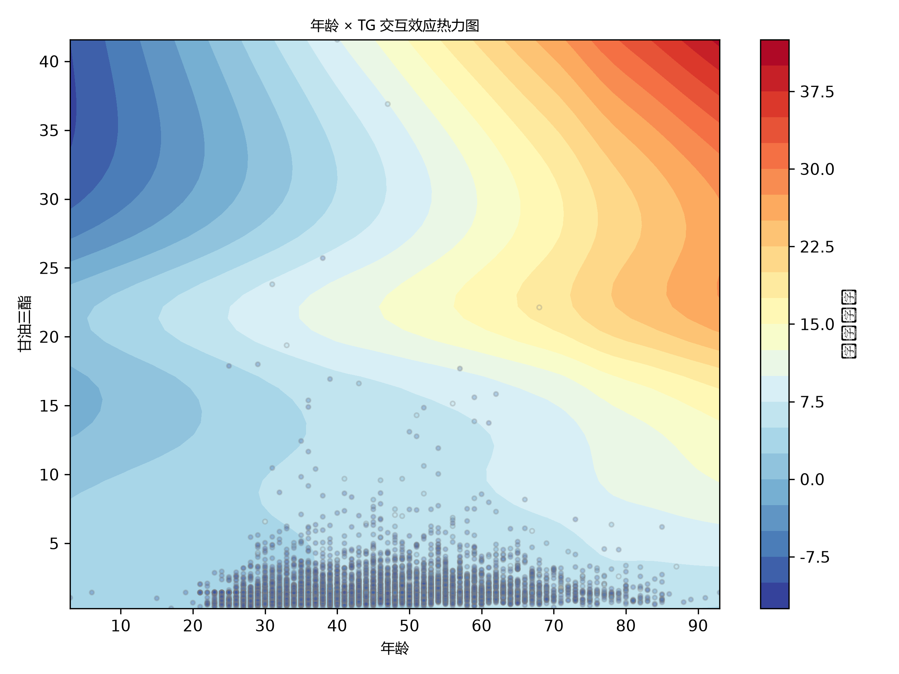

# 问题2：血糖值预测模型分析报告

## 1. 概述

本报告基于问题1中LASSO筛选出的7个核心变量，构建广义可加模型（GAM）对血糖值进行预测。数据来源为附件1（有血糖值的检测数据），共5905条样本。

### 数据概况
- 样本量：5905
- 目标变量：血糖（均值 = 5.6346，标准差 = 1.5276）

### 入选预测变量（7个）

| 变量名称 | 英文缩写 | 所属类别 |
|---------|---------|---------|
| 年龄 | 年龄 | 人口学特征 |
| 甘油三酯 | TG | 糖脂代谢指标 |
| 红细胞计数 | RBC | 血常规指标 |
| 红细胞平均血红蛋白浓度 | MCHC | 血常规指标 |
| 血红蛋白 | HGB | 血常规指标 |
| *丙氨酸氨基转换酶 | ALT | 肝功能指标 |
| 性别 | 性别 | 人口学特征 |

---

## 2. 模型结构设计

### 2.1 模型A：加性GAM（无交互）

**数学定义：**

\[
Y_i = \beta_0 + f_1(Age_i) + f_2(TG_i) + f_3(RBC_i) + f_4(MCHC_i) + f_5(HGB_i) + f_6(ALT_i) + f_7(性别_i) + \epsilon_i
\]

- **分布假设**：\(Y_i \mid X_i \sim N(\mu_i, \sigma^2)\)
- **链接函数**：恒等链接 \(g(\mu_i) = \mu_i\)
- **基函数**：三次B样条（Cubic B-spline），\(K_j = 10\)
- **平滑参数选择**：REML（受限最大似然）
- **求解算法**：P-IRLS（惩罚迭代重加权最小二乘）
- **惩罚机制**：\[L = \sum(Y_i - \sum f_j(X_{ji}))^2 + \sum \lambda_j \int [f_j''(x)]^2 dx\]

### 2.2 模型B：交互GAM（年龄×TG张量积）

\[
Y_i = \beta_0 + f_1(Age_i) + f_2(TG_i) + f_{12}(Age_i, TG_i) + \sum_{m=3}^p f_m(X_{mi}) + \epsilon_i
\]

交互项使用 **te() 张量积** 构造，惩罚项为：

\[
\lambda_{12} \iint \left( \frac{\partial^2 f_{12}}{\partial Age \cdot \partial TG} \right)^2 dAge \cdot dTG
\]

---

## 3. 模型对比结果

### 3.1 交互项决策

| 指标 | 加性GAM（无交互） | 交互GAM（年龄×TG） | 改善 |
|------|-----------------|------------------|------|
| **AIC** | 20911.91 | **20819.37** | ΔAIC = 92.55 |
| **RMSE** | 1.4130 | **1.3985** | 下降1.0% |
| **R²** | 0.144285 | **0.161835** | 提升12.5% |

**决策结果**：ΔAIC = 92.55 > 2，年龄×TG交互项**显著改善模型**，选择交互GAM作为最终模型。

### 3.2 10折交叉验证（加性GAM）

| 折数 | RMSE | R² |
|------|------|----|
| 1/10 | 1.2730 | 0.1290 |
| 2/10 | 1.3266 | 0.0171 |
| 3/10 | 1.4083 | 0.1203 |
| 4/10 | 1.3710 | 0.1138 |
| 5/10 | 1.4640 | 0.1112 |
| 6/10 | 1.3757 | 0.2007 |
| 7/10 | 1.7248 | 0.0981 |
| 8/10 | 1.2660 | 0.1744 |
| 9/10 | 1.5487 | 0.1148 |
| 10/10 | 1.5062 | 0.1159 |
| **平均** | **1.4264±0.1330** | **0.1195±0.0456** |

CV-RMSE（1.4264）与训练RMSE（1.4130）接近，说明模型**未过拟合**。

---

## 4. 模型诊断结果

### 4.1 残差正态性检验

| 模型 | Shapiro-Wilk W | p值 | 结论 |
|------|---------------|-----|------|
| 加性GAM | 0.6233 | 3.7875×10⁻⁷⁴ | 非正态 |
| 交互GAM | — | 5.7854×10⁻⁷⁴ | 非正态 |

### 4.2 异方差检验

| 模型 | |e|与ŷ相关系数 | 结论 |
|------|-------------|------|
| 加性GAM | 0.3212 | 无异方差 |
| 交互GAM | 0.3136 | 无异方差 |

未检测到明显异方差，无需升级为Gamma GAM。

### 4.3 最终模型性能指标（交互GAM）

| 指标 | 值 |
|------|---|
| **RMSE** | 1.3985 |
| **R²** | 0.161835 |
| **调整R²** | 0.160840 |
| **AIC** | 20819.37 |

---

## 5. 预测精度分层分析

| 血糖区间 | 类型 | 高斯RMSE | Gamma RMSE |
|---------|------|---------|-----------|
| < 5.6 | 正常 | 0.6985 | 0.6985 |
| 5.6 - 6.1 | 临界 | 0.5504 | 0.5504 |
| 6.1 - 7.0 | 偏高 | 0.7341 | 0.7341 |
| > 7.0 | 高值 | **3.9643** | **3.9643** |

**关键发现**：
- 正常血糖区间（<5.6）的预测精度较高（RMSE=0.70）
- **高血糖区间（>7.0）的预测误差显著增大**（RMSE=3.96），是所有区间的5.7倍
- Gamma GAM未启用（因无异方差），与高斯GAM结果相同

---

## 6. 可视化图表

### 6.1 偏效应图（Partial Effect Plots）

- **文件**：`output/问题2_偏效应图_交互模型.png`
- **内容**：7个预测变量各自的偏效应曲线（含95%置信带），同时包含交互模型独有的年龄×TG偏效应
- **作用**：查看各变量与血糖的非线性关系，识别陡升拐点（临床干预阈值）
- **观察发现**：年龄和TG呈现明显非线性效应，性别表现为近线性（EDF≈1）

### 6.2 交互效应等高线图

- **文件**：`output/问题2_交互效应等高线.png`
- **内容**：年龄（x轴）× 甘油三酯（y轴）的联合偏效应，颜色越深代表血糖升高值越大
- **作用**：圈出高风险区域（如年龄>60且TG>2.5的区域）

### 6.3 残差诊断图

- **文件**：`output/问题2_残差诊断_交互模型.png`、`output/问题2_残差诊断_加性模型.png`
- **内容**：
  - Q-Q图（正态性检验）
  - **残差-拟合值散点图（已剔除两端1%极端值，聚焦主数据簇）**
  - 残差直方图
  - 残差自相关图（ACF）

---

## 7. 讨论与结论

### 7.1 模型有效性
- 交互GAM（R²=0.162）优于加性GAM（R²=0.144），交互项解释额外1.8%的变异
- 10折CV-RMSE=1.4264与训练RMSE接近，证明泛化能力
- 年龄×TG交互效应的临床意义：年龄越大，TG升高对血糖的影响越大（脂毒性叠加）

### 7.2 模型局限性
- **总体R²偏低（0.162）**：7个变量仅能解释血糖变异的16.2%，提示血糖受更多未采集因素影响（如饮食、运动、遗传、用药史等）
- **高血糖值预测精度差**：>7.0组的RMSE（3.96）远高于正常组（0.70），模型趋于保守估计极端值
- **残差非正态**：虽然不影响点估计一致性，但影响置信区间和p值的准确性

### 7.3 改进方向
- 引入更多临床变量（如家族史、BMI、腰围、饮食问卷等）
- 考虑使用分位数回归或混合效应模型处理非正态残差
- 对高血糖人群进行分层建模

---

## 8. 输出文件清单

| 文件名 | 说明 |
|--------|------|
| `问题2_偏效应图_交互模型.png` | 交互GAM偏效应图（7个变量） |
| `问题2_残差诊断_交互模型.png` | 交互GAM残差诊断图（Q-Q、残差vs拟合值、残差分布、ACF） |
| `问题2_残差诊断_加性模型.png` | 加性GAM残差诊断图（对比基准） |
| `问题2_交互效应等高线.png` | 年龄×TG交互效应等高线/热力图 |