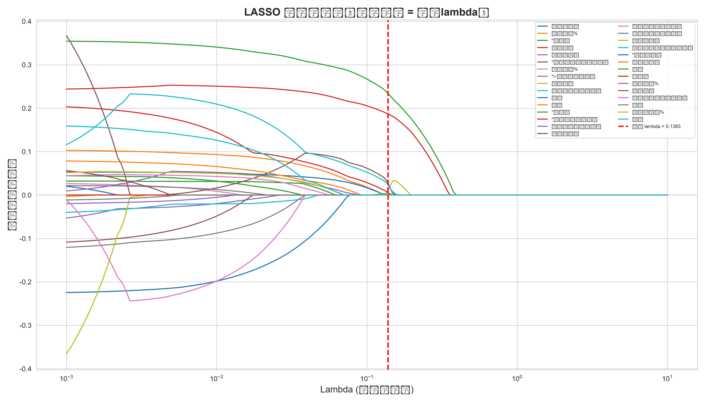
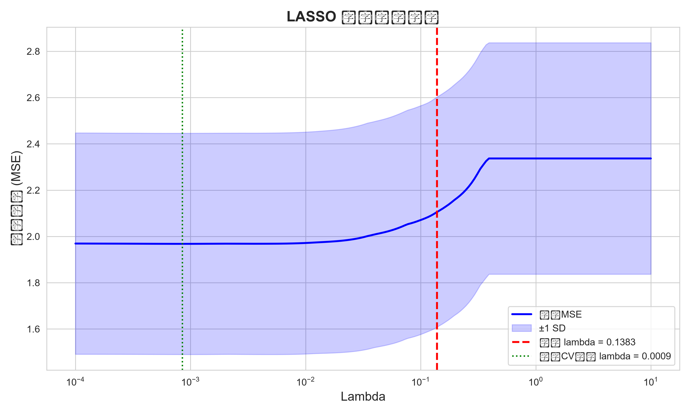
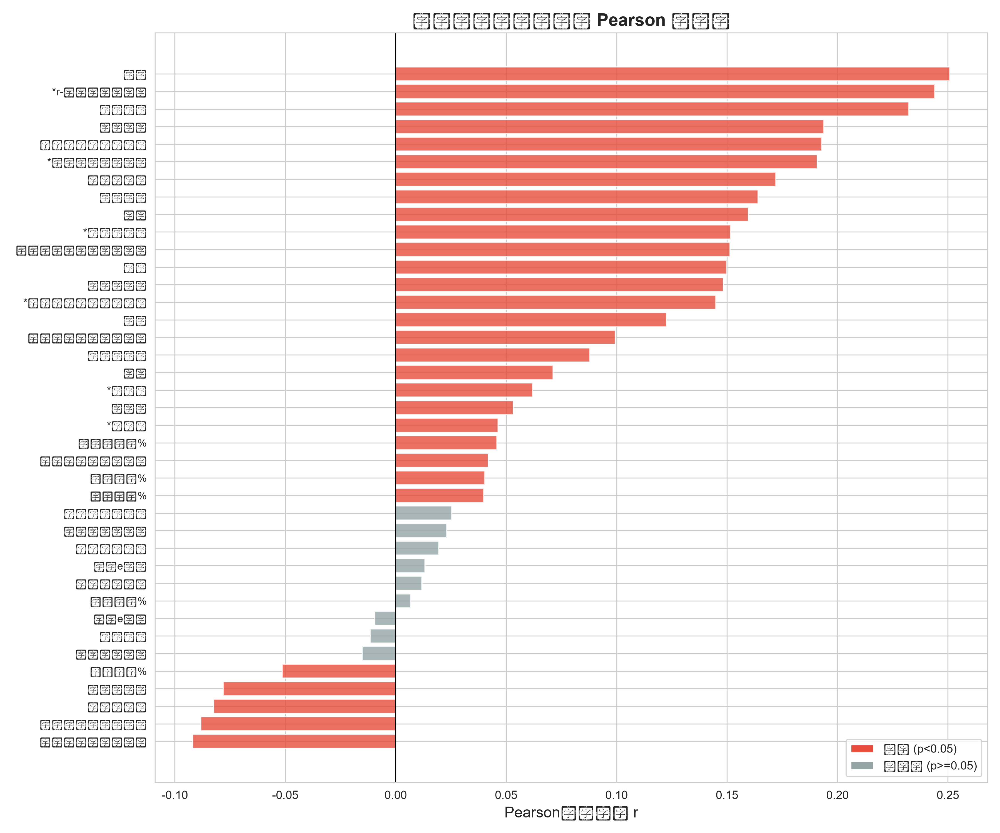
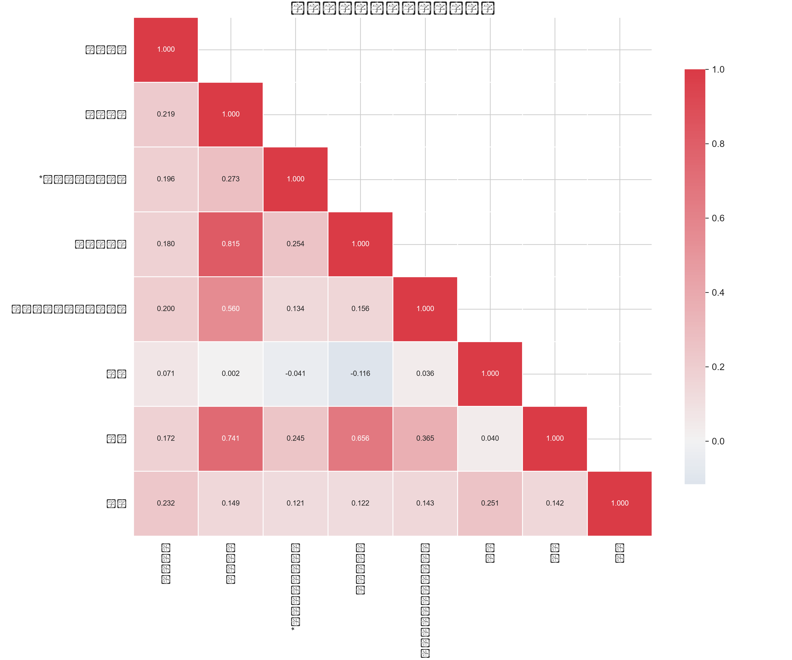
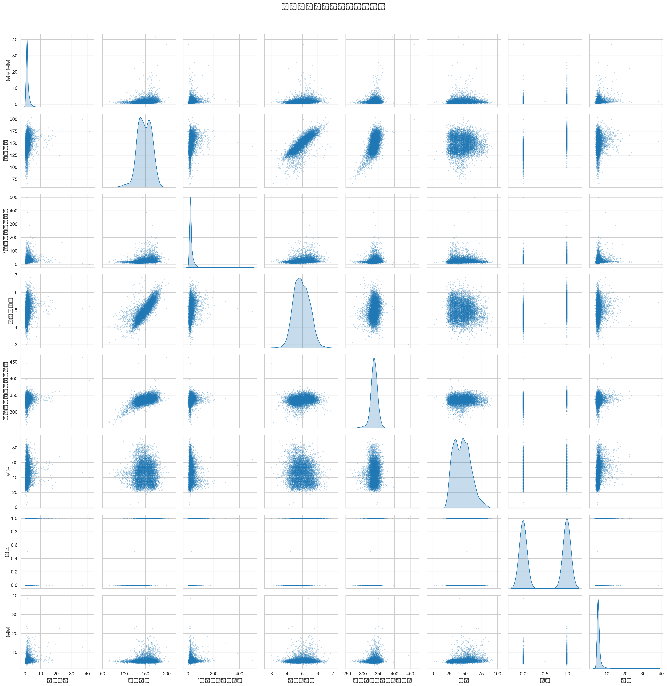

# 问题1：主要变量指标筛选——分析报告

## 1. 概述

### 1.1 分析目标

从糖尿病体检数据的42个检测指标中，筛选出与血糖值（目标变量）最为相关的核心变量，为后续预测建模和风险评估提供精简且具有解释力的特征集合。

### 1.2 数据概况

| 项目 | 内容 |
|------|------|
| 数据来源 | 附件1：有血糖值的检测数据.csv |
| 样本量 | 5905条记录 |
| 检测指标 | 42项 |
| 目标变量 | 血糖（均值=5.6346，标准差=1.5276） |
| 不参与建模变量 | id、体检日期 |

### 1.3 变量分类体系

依据临床检验医学分类及人体生理功能，将39个候选变量划分为6大类：

| 类别 | 变量数 | 变量名称 |
|------|--------|----------|
| 人口学特征 | 2 | 性别、年龄 |
| 糖脂代谢指标 | 4 | TG（甘油三酯）、TC（总胆固醇）、HDL-C（高密度脂蛋白胆固醇）、LDL-C（低密度脂蛋白胆固醇） |
| 肝功能指标 | 8 | AST（天门冬氨酸氨基转换酶）、ALT（丙氨酸氨基转换酶）、ALP（碱性磷酸酶）、GGT（r-谷氨酰基转换酶）、TP（总蛋白）、ALB（白蛋白）、GLB（球蛋白）、A/G（白球比例） |
| 肾功能指标 | 3 | BUN（尿素）、Cr（肌酐）、UA（尿酸） |
| 血常规指标 | 17 | WBC、RBC、HGB、HCT、MCV、MCH、MCHC、RDW、PLT、MPV、PDW、PCT、NEU%、LYM%、MON%、EOS%、BAS% |
| 感染免疫指标 | 5 | HBsAg、HBsAb、HBeAg、HBeAb、HBcAb（乙肝五项） |

## 2. 数据预处理

### 2.1 缺失值处理

采用中位数填补法对所有连续变量的缺失值进行处理，填补后保留全部39个候选变量和5905个样本用于分析。

### 2.2 变量编码

对于性别（二分类变量：男/女），在后续分析中映射为数值型（男=1，女=0）。

## 3. 单因素统计筛选（Step 2）

### 3.1 筛选方法

- **连续变量**：计算每个变量与血糖值的Pearson相关系数r和Spearman相关系数ρ。若Spearman的p值更小，则优先采用Spearman相关系数，以捕捉可能存在的非线性单调关系。
- **二分类变量（性别）**：采用Welch独立样本t检验，比较男女两组的血糖均值差异，并计算点二列相关系数。

筛选标准：p < 0.05 视为显著，保留该变量进入下一轮。

### 3.2 筛选结果

| 指标 | 结果 |
|------|------|
| 候选变量总数 | 39 |
| 通过显著（p < 0.05） | 30 |
| 未通过 | 9 |
| 通过率 | 76.9% |

**未通过单因素筛选的变量（9个）**：MPV（血小板平均体积）、MCV（红细胞平均体积）、HBsAg（乙肝表面抗原）、HBsAb（乙肝表面抗体）、HBeAg（乙肝e抗原）、HBcAb（乙肝核心抗体）、A/G（白球比例）、HBeAb（乙肝e抗体）、MON%（单核细胞比例）。

### 3.3 与血糖相关性最强的Top 10变量

| 排名 | 变量（中文） | 变量（英文） | 选用相关系数r | p值 | 方向 |
|------|-------------|-------------|--------------|------|------|
| 1 | 年龄 | 年龄 | 0.2508 | 0.0000 | 正相关 |
| 2 | 甘油三酯 | TG | 0.2324 | 0.0000 | 正相关 |
| 3 | r-谷氨酰基转换酶 | GGT | 0.2440 | 8.93e-81 | 正相关 |
| 4 | 血红蛋白 | HGB | 0.1939 | 3.98e-51 | 正相关 |
| 5 | 低密度脂蛋白胆固醇 | LDL_C | 0.1928 | 1.51e-50 | 正相关 |
| 6 | 丙氨酸氨基转换酶 | ALT | 0.1909 | 1.34e-49 | 正相关 |
| 7 | 红细胞压积 | HCT | 0.1721 | 1.78e-40 | 正相关 |
| 8 | 总胆固醇 | TC | 0.1640 | 6.88e-37 | 正相关 |
| 9 | 尿素 | BUN | 0.1597 | 5.13e-35 | 正相关 |
| 10 | 碱性磷酸酶 | ALP | 0.1516 | 1.08e-31 | 正相关 |

### 3.4 各类别通过率

| 类别 | 通过数/总数 | 通过率 |
|------|------------|--------|
| 人口学特征 | 2/2 | 100% |
| 糖脂代谢指标 | 4/4 | 100% |
| 肝功能指标 | 7/8 | 88% |
| 肾功能指标 | 3/3 | 100% |
| 血常规指标 | 14/17 | 82% |
| 感染免疫指标 | 0/5 | 0% |

感染免疫指标（乙肝五项）全部未通过单因素筛选，提示在本次数据中乙肝相关指标与血糖水平无显著的线性关联。

## 4. LASSO变量压缩（Step 3）

### 4.1 筛选方法

采用带L1正则化的LASSO回归模型。核心思想是在最小二乘损失函数中加入L1惩罚项（λ∑|βᵢ|），将不重要变量的系数压缩为0，实现自动变量选择。

**自适应搜索策略**：从最小CV误差对应的lambda开始，逐步增大lambda（增强正则化），在6~9个入选变量的区间内自动选择合适的lambda值。

### 4.2 筛选结果

| 指标 | 结果 |
|------|------|
| 候选变量数 | 30 |
| 最小CV误差lambda | 0.000850（27个变量） |
| 选定lambda | 0.138262 |
| LASSO最终选中 | **7个变量** |

### 4.3 最终入选变量及标准化系数

| 变量（中文） | 变量（英文） | 所属类别 | 标准化系数 | |系数|排名 |
|-------------|-------------|----------|-----------|--------|------|
| 年龄 | 年龄 | 人口学特征 | 0.233829 | 1 |
| 甘油三酯 | TG | 糖脂代谢指标 | 0.186724 | 2 |
| 红细胞计数 | RBC | 血常规指标 | 0.026659 | 3 |
| 红细胞平均血红蛋白浓度 | MCHC | 血常规指标 | 0.023098 | 4 |
| 血红蛋白 | HGB | 血常规指标 | 0.011130 | 5 |
| 丙氨酸氨基转换酶 | ALT | 肝功能指标 | 0.005399 | 6 |
| 性别 | 性别 | 人口学特征 | 0.002060 | 7 |

**所有入选变量的系数均为正数**，表明这些指标与血糖水平呈正向关联，即指标值越高，血糖水平趋向于越高。

## 5. 最终变量类别分布

### 5.1 各类别入选情况

| 类别 | 原变量数 | 入选数 | 入选变量 |
|------|---------|--------|----------|
| 人口学特征 | 2 | 2 | 性别、年龄 |
| 糖脂代谢指标 | 4 | 1 | 甘油三酯（TG） |
| 肝功能指标 | 8 | 1 | 丙氨酸氨基转换酶（ALT） |
| 肾功能指标 | 3 | 0 | — |
| 血常规指标 | 17 | 3 | 红细胞计数（RBC）、血红蛋白（HGB）、红细胞平均血红蛋白浓度（MCHC） |
| 感染免疫指标 | 5 | 0 | — |

### 5.2 医学合理性解释

1. **年龄和性别**是糖代谢异常的基础人口学影响因素，高龄和男性群体普遍面临更高的糖尿病风险。
2. **甘油三酯（TG）**是脂代谢紊乱的核心标志物，与胰岛素抵抗密切相关，是糖尿病预测的主要代谢指标之一。
3. **丙氨酸氨基转换酶（ALT）**作为肝细胞损伤的敏感标志，反映肝脏糖原合成与糖异生功能状态，肝酶升高与代谢综合征存在密切关联。
4. **红细胞计数（RBC）、血红蛋白（HGB）、红细胞平均血红蛋白浓度（MCHC）**等血常规指标反映机体氧输送能力及炎症状态，慢性低度炎症已被证实参与胰岛素抵抗的发生发展。

## 6. 可视化分析

### 6.1 LASSO系数路径图

- **横轴**：正则化参数lambda的对数值（logλ），从左到右正则化强度递增。
- **纵轴**：各变量的标准化回归系数。
- **红色虚线**：选定的lambda值（0.138262）。
- **解读**：当lambda较小时（左侧），几乎所有变量均有非零系数。随着lambda增大，系数被逐渐压缩为零。红色虚线位置仅剩7条非零轨迹线，对应最终入选的7个变量。

### 6.2 LASSO交叉验证曲线

- **横轴**：logλ。
- **纵轴**：5折交叉验证的均方误差（MSE）。
- **绿色点线**：最小CV误差对应的lambda位置（0.000850，选中27个变量）。
- **红色虚线**：选定lambda位置（0.138262，选中7个变量）。
- **解读**：从最小误差lambda向右移动至选定lambda的过程中，CV误差仅有微小增加，但变量数从27大幅压缩至7。这表明在模型精度损失很小的情况下，获得了显著更高的模型简洁性。

### 6.3 单因素相关性条形图

- **横轴**：Pearson相关系数r。
- **纵轴**：39个候选变量。
- **颜色**：红色 = 与血糖显著相关（p < 0.05），灰色 = 不显著。
- **解读**：年龄和甘油三酯显示出最强的正相关性（r ≈ 0.25），其次是血红蛋白、LDL-C、ALT等。几乎所有糖脂代谢和血常规指标均与血糖显著相关，而感染免疫指标（乙肝五项）均不显著。

### 6.4 入选变量相关系数热力图

- **展示内容**：最终7个入选变量 + 血糖之间的相关系数矩阵。
- **解读**：
  - 血糖与年龄（r=0.25）和TG（r=0.23）相关性最强。
  - RBC与HGB（r≈0.8~0.9）之间存在高度正相关，这是正常的生理关联（红细胞携带血红蛋白）。
  - MCHC与RBC/HGB存在中等程度关联。
  - 各变量与血糖的相关系数均低于0.3，提示血糖受多因素共同影响，单一变量的解释力有限。

### 6.5 入选变量散点图矩阵

- **展示内容**：7个入选变量 + 血糖的逐个配对散点图。
- **解读**：
  - 血糖分布整体右偏，存在少量高血糖极端值。
  - 年龄与血糖的散点呈现弱正向趋势，老年群体血糖水平较高。
  - TG与血糖的散点显示正相关趋势，但高TG个体血糖值存在较大离散。
  - RBC、HGB、MCHC等血常规指标与血糖的散点分布较分散，线性趋势较弱。

## 7. 结论与讨论

### 7.1 筛选结论

通过两阶段筛选策略（单因素相关性分析 + LASSO正则化回归），从原始39个候选变量中成功筛选出**7个核心变量**，覆盖人口学特征（年龄、性别）、糖脂代谢（甘油三酯）、肝功能（ALT）和血常规（RBC、HGB、MCHC）4个临床类别。

### 7.2 筛选策略优势

1. **先单因素、后LASSO的两阶段设计**：单因素筛选快速剔除9个明显无关变量，降低后续LASSO计算维度；LASSO进一步从30个变量中压缩至7个，形成双重筛选保障。
2. **Spearman + Pearson双指标**：兼顾线性相关和单调非线性关系，提高筛选的全面性。
3. **LASSO自适应搜索**：自动在6~9个变量目标区间内确定最优正则化强度，兼顾模型简洁性和预测精度。

### 7.3 局限性

1. 单因素筛选无法捕捉变量间的交互效应和联合作用。
2. LASSO在强相关变量群中倾向于只保留其中一个代表变量（如RBC入选而HCT未入选，虽两者高度相关）。
3. 本筛选基于线性框架，对于复杂的非线性关联可能存在遗漏。
4. 感染免疫指标全部被剔除，但理论上乙肝相关肝脏炎症可能通过间接途径影响糖代谢，需结合专业知识进一步研判。

### 7.4 后续工作

筛选出的7个变量将作为**问题2（血糖预测模型）**和**问题3（糖尿病风险评估）**的核心特征集合。在后续建模中，还将进一步验证这些变量的预测能力和交互效应，并通过VIF分析评估多重共线性问题。