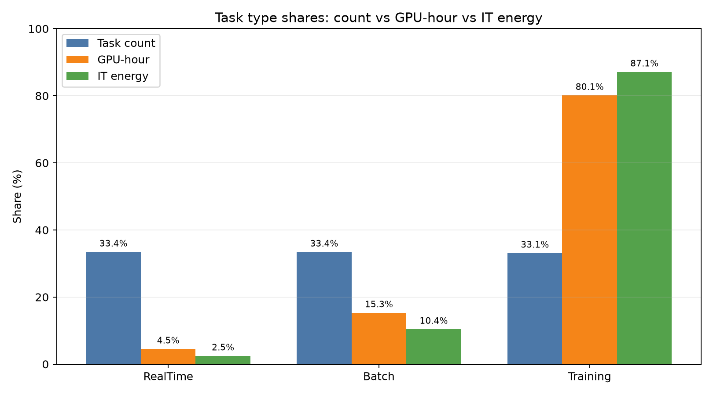
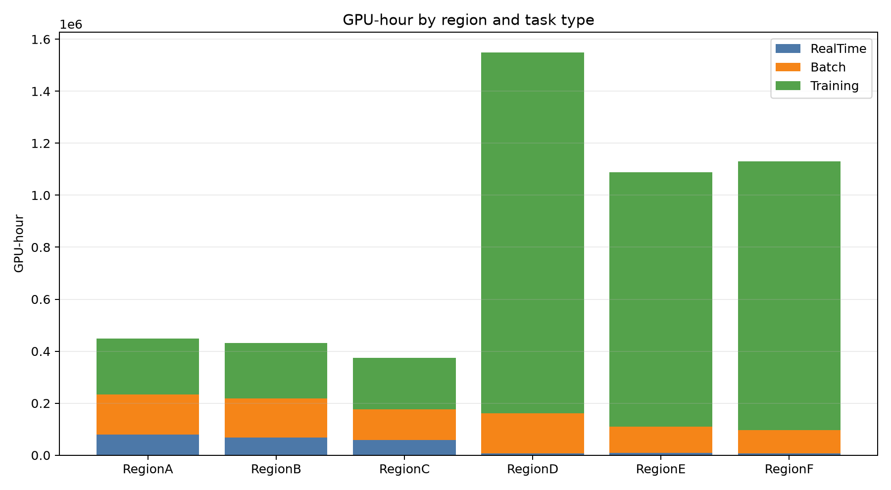
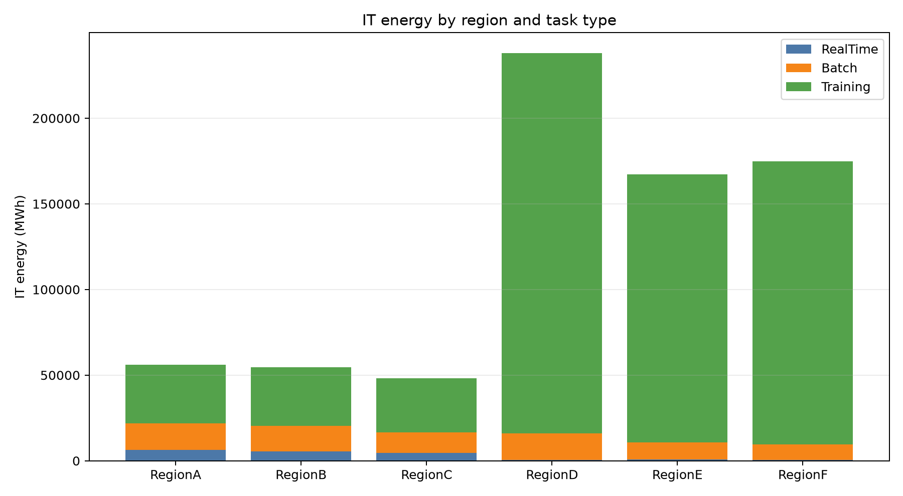
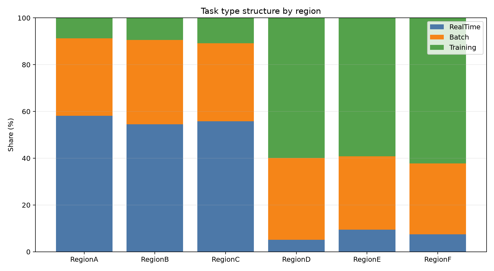
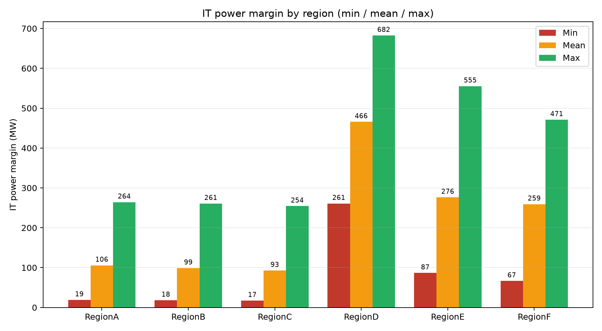
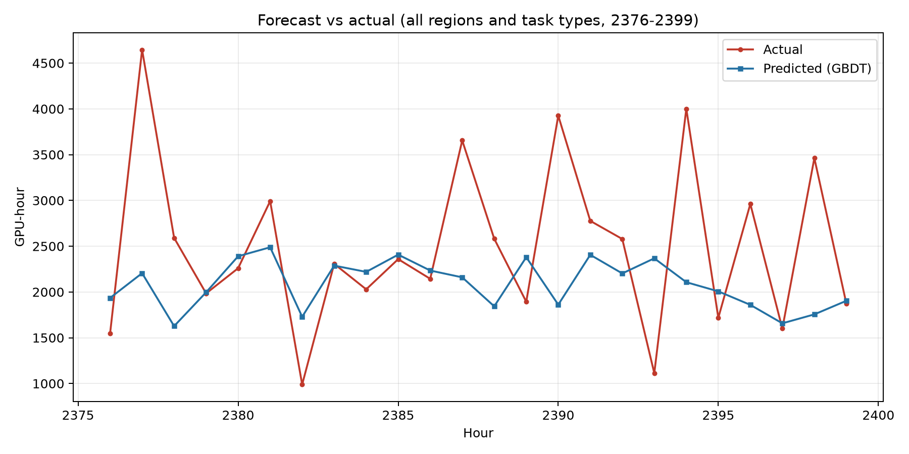

# 问题一：AI 工作负载统计分析报告

> 数据来源：`workload_trace.xlsx`（50000 条任务轨迹）、`GPU_information.xlsx`、`network_latency.xlsx`、`power_mapping.xlsx`、`region_time_data.xlsx`
> 统计口径：以 GPU-hour（= GPU_Demand × 时长）为需求量纲，以 IT 能耗（= GPU-hour × 单位等效 GPU 功率）为能量纲。

---

## 1. 总体规模

| 指标 | 数值 |
|---|---|
| 任务总数 | 50000 |
| 总 GPU-hour | 5,020,786.65 |
| 总 IT 能耗 | 738,927.99 MWh |

---

## 2. 任务类型结构

| 任务类型 | 任务数 | 占比 | GPU-hour | 占比 | IT 能耗(MWh) | 占比 |
|---|---|---|---|---|---|---|
| RealTimeInference | 16724 | 33.45% | 228,150.13 | 4.54% | 18,252.01 | 2.47% |
| BatchInference | 16717 | 33.43% | 769,097.80 | 15.32% | 76,909.78 | 10.41% |
| AITraining | 16559 | 33.12% | 4,023,538.72 | 80.14% | 643,766.19 | 87.12% |

**关键结论**：三类任务在数量上几乎均分（各约 1/3），但 **AI 训练任务贡献了 80.14% 的 GPU-hour 与 87.12% 的 IT 能耗**，是数据中心的核心柔性负荷。实时推理任务数量虽多，但单任务 GPU 需求小、时长短，GPU-hour 占比仅 4.54%。



---

## 3. 区域 × 类型任务数

| 区域 | AITraining | BatchInference | RealTimeInference | 合计 |
|---|---|---|---|---|
| RegionA | 879 | 3331 | 5852 | 10062 |
| RegionB | 871 | 3312 | 5017 | 9200 |
| RegionC | 815 | 2523 | 4221 | 7559 |
| RegionD | 5726 | 3346 | 488 | 9560 |
| RegionE | 4091 | 2172 | 649 | 6912 |
| RegionF | 4177 | 2033 | 497 | 6707 |
| **合计** | **16559** | **16717** | **16724** | **50000** |

---

## 4. 区域 × 类型 GPU-hour

| 区域 | AITraining | BatchInference | RealTimeInference | 合计 |
|---|---|---|---|---|
| RegionA | 214,319.28 | 154,341.45 | 79,791.72 | 448,452.45 |
| RegionB | 212,294.63 | 151,260.43 | 67,203.08 | 430,758.15 |
| RegionC | 198,331.97 | 117,897.37 | 58,704.95 | 374,934.28 |
| RegionD | 1,387,122.68 | 155,177.20 | 6,558.55 | 1,548,858.43 |
| RegionE | 978,535.12 | 100,158.33 | 9,054.77 | 1,087,748.22 |
| RegionF | 1,032,935.03 | 90,263.02 | 6,837.07 | 1,130,035.12 |
| **合计** | **4,023,538.72** | **769,097.80** | **228,150.13** | **5,020,786.65** |



---

## 5. 区域 × 类型 IT 能耗（MWh）

| 区域 | AITraining | BatchInference | RealTimeInference | 合计 |
|---|---|---|---|---|
| RegionA | 34,291.09 | 15,434.15 | 6,383.34 | 56,108.57 |
| RegionB | 33,967.14 | 15,126.04 | 5,376.25 | 54,469.43 |
| RegionC | 31,733.11 | 11,789.74 | 4,696.40 | 48,219.25 |
| RegionD | 221,939.63 | 15,517.72 | 524.68 | 237,982.03 |
| RegionE | 156,565.62 | 10,015.83 | 724.38 | 167,305.83 |
| RegionF | 165,269.61 | 9,026.30 | 546.97 | 174,842.87 |
| **合计** | **643,766.19** | **76,909.78** | **18,252.01** | **738,927.99** |



---

## 6. 区域任务类型结构（占比）

| 区域 | AITraining | BatchInference | RealTimeInference |
|---|---|---|---|
| RegionA | 8.74% | 33.10% | 58.16% |
| RegionB | 9.47% | 36.00% | 54.53% |
| RegionC | 10.78% | 33.38% | 55.84% |
| RegionD | 59.90% | 35.00% | 5.10% |
| RegionE | 59.19% | 31.42% | 9.39% |
| RegionF | 62.28% | 30.31% | 7.41% |

**关键结论**：空间异质性显著。东部三区（A/B/C）以实时推理为主（占比 54.5%–58.2%），西部三区（D/E/F）以 AI 训练为主（占比 59.2%–62.3%）。这与区域定位一致：东部靠近用户侧、时延敏感；西部算力与新能源资源富集、适合承接训练任务。



---

## 7. 区域 IT 功率余量（MW）

| 区域 | 最小余量 | 平均余量 | 最大余量 |
|---|---|---|---|
| RegionA | 18.98 | 105.84 | 264.33 |
| RegionB | 18.21 | 98.93 | 260.82 |
| RegionC | 17.37 | 92.86 | 254.33 |
| RegionD | 260.98 | 465.82 | 682.48 |
| RegionE | 86.58 | 276.43 | 555.43 |
| RegionF | 66.58 | 259.30 | 471.13 |

**关键结论**：IT 功率是紧约束。东部三区功率余量最小仅 17–19 MW，一个训练任务（如 127 GPU × 0.16 MW ≈ 20 MW）即可吃满余量；而西部三区余量充裕（最小 66–261 MW）。GPU 容量整体松弛约 2.5 倍，因此功率而非 GPU 容量是调度瓶颈。



---

## 8. 基础调度模型（建模过程）

本节给出问题一基础调度模型的完整定义，包括决策变量、约束体系、字典序目标函数与求解算法，使调度准则可复现、可评审。

### 8.1 决策变量

- `x_{i,r} ∈ {0,1}`：任务 i 是否在区域 r 执行（唯一性：Σ_r x_{i,r} = 1）；
- `s_i ∈ ℤ`：开工小时（实时任务 s_i = a_i；弹性任务 a_i ≤ s_i ≤ f_i − d_i）。

### 8.2 重叠量定义（分钟级折算）

任务 i 在小时 t 内的实际运行小时数：

```
o(i,t) = max(0, min(t+1, s_i + d_i) − max(t, s_i))，0 ≤ o ≤ 1
```

该定义将分钟级时长精确折算到小时容量，避免整小时取整误差。

### 8.3 约束体系（C1–C7）

| 编号 | 约束 | 表达 |
|---|---|---|
| C1 | 唯一性 | Σ_r x_{i,r} = 1，∀i |
| C2 | 实时任务即时开工 | s_i = a_i，∀i ∈ RT |
| C3 | 网络时延 | Σ_r D_{σ_i,r}·x_{i,r} ≤ L_i，∀i |
| C4 | 完成时限 | s_i + d_i ≤ f_i，且 s_i ≥ a_i |
| C5 | GPU 容量 | Σ_i g_i·o(i,t)·x_{i,r} ≤ G_r，∀r,t |
| C6 | IT 功率 | Σ_i g_i·p_{τ_i}·o(i,t)·x_{i,r} ≤ M_r − N_r(t)，∀r,t |
| C7 | 不占第 2406 小时 | s_i + d_i ≤ 2406 |

其中：`G_r` 为区域可用 GPU，`M_r` 为最大 IT 功率，`N_r(t)` 为逐时 NonAI 负荷，`p_τ` 为任务类型单位等效 GPU 功率（RT=0.08、BI=0.10、AT=0.16 MW/等效GPU），`D_{σ,r}` 为来源区域到执行区域的单向时延。由于所有区域满足 `Max_Facility_Power = Max_IT_Power × PUE`，设施功率约束被 IT 约束数学蕴含，故不单列。

### 8.4 目标函数（字典序分层）

| 层 | 目标 | 表达 |
|---|---|---|
| L0 | 硬约束全部满足 | C1–C7 |
| L1 | 最小化迁移 | min Σ_i Σ_{r≠σ_i} x_{i,r} |
| L2 | 最小化等待 | min Σ_{i∉RT} (s_i − a_i) |
| L3 | 负载均衡 | min max_r Ū_r − min_r Ū_r，Ū_r = Σ_i g_i d_i x_{i,r} / (G_r·|T|) |

求解采用**顺序求解（严格字典序）**：先求 L1 最优值 F1\*，在 L1 ≤ F1\*+ε 下优化 L2，再在 (L1,L2) 约束下优化 L3。该分层保证"迁移最少"优先于"等待最少"，"等待最少"优先于"负载均衡"。

### 8.5 求解算法（构造式启发式 + 局部搜索）

- **Step 1 排序**：按 `f_i − d_i` 升序（最早截止优先 EDF）→ 次级 `g_i` 降序 → `a_i` 升序；
- **Step 2 候选区域集**：`R_i = {r : D_{σ_i,r} ≤ L_i}`，仅保留满足时延 SLA 的区域；
- **Step 3 逐任务指派**：
  - 实时任务：`s_i = a_i`，先试本地 `σ_i`；若本地 C5/C6 违约才查 `R_i` 内次优区域；
  - 弹性任务：对 `r ∈ R_i` 按（迁移惩罚, 当前利用率）排序，逐个从 `s = a_i` 起扫描，找满足 C4/C5/C6 的最小可行 s；GPU 与 IT 双容量累计数组 `cap_gpu[r][t]`、`cap_it[r][t]` 随任务增量维护；
- **Step 4 局部搜索**：对利用率峰值最高区域中的弹性任务，尝试重定位到低利用率可行区域（不违约才接受），循环至无改善。

**复杂度**：O(|I| × |R_i| × 平均扫描深度 × d̄)，规模 50000 × 6 × ~10 × 4，实际秒级~分钟级。

### 8.6 可行性论证

- 总量松弛约 2.5 倍（需求 502 万 vs 容量 1252 万 GPU-hour）；
- 实时任务本地执行全时域 2406 小时 0 违规（已实测）；
- 构造算法每步显式检查 C1–C7 → 输出方案必然可行。

---

## 9. 基础调度结果

| 指标 | 数值 |
|---|---|
| 成功调度任务数 | 50000 / 50000 |
| 迁移任务数 | 0 |
| 弹性任务平均等待 | 0.0039 h |

**约束验证**：C1–C7 全部通过，违规数为 0。

| 约束 | 违规数 | 状态 |
|---|---|---|
| C1 唯一性 | 0 | PASS |
| C2 实时任务即时开工 | 0 | PASS |
| C3 网络时延 | 0 | PASS |
| C4 完成时限 | 0 | PASS |
| C5 GPU 容量 | 0 | PASS |
| C6 IT 功率 | 0 | PASS |
| C7 不占第 2406 小时 | 0 | PASS |

### 9.1 "0 迁移"的成因解释

"0 迁移"**不是数据巧合，而是目标函数 L1（最小化迁移）与算法共同作用的结果**：

1. **目标函数显式最小化迁移**：字典序目标 L1 为 `min Σ_i Σ_{r≠σ_i} x_{i,r}`，且优先级最高。算法在 Step 3 中**优先尝试本地区域 σ_i**，只有本地 C5/C6 违约时才考虑迁移，因此迁移被目标与算法双重抑制。
2. **数据可行性**：总量 GPU 容量松弛约 2.5 倍，且实测所有实时任务本地执行全时域 0 违规；弹性任务在本地扫描即可找到满足 C4/C5/C6 的开工时刻，无需跨区。
3. **结论**：在纯算力 SLA 基准（不引入电价/碳/新能源）下，所有任务均可在来源区域本地执行，迁移数达到理论下界 0，等待时间近乎为 0。迁移的动机将在问题二引入电价、碳强度与新能源后由"被迫"转为"主动"。

---

## 10. 短期预测结果（2376–2399 小时）

预测对象为 18 条小时级序列（6 区域 × 3 类型）的 GPU-hour 需求。模型为 GBDT（HistGradientBoosting），并与 Last-Value、同期均值两个朴素基线对比。

**聚合指标（GBDT）**：

| 层级 | RMSE | sMAPE(%) |
|---|---|---|
| 总量（全区域全类型） | 1017.40 | 29.55 |
| RegionA | 188.91 | 88.08 |
| RegionB | 197.83 | 71.02 |
| RegionC | 114.62 | 80.89 |
| RegionD | 505.37 | 76.65 |
| RegionE | 647.88 | 86.02 |
| RegionF | 574.02 | 65.11 |

**说明**：总量序列的 sMAPE 为 29.55%，显著优于单序列（单序列零值多、波动大，sMAPE 偏高）。GBDT 在多数序列上优于或接近朴素基线，验证了短期负荷感知能力。预测与调度解耦，调度统一以实际到达任务为输入。



---

## 11. 主要结论

1. **训练任务主导**：AI 训练贡献 80.14% 的 GPU-hour 与 87.12% 的 IT 能耗，是核心柔性负荷。
2. **IT 功率为紧约束**：东部三区功率余量最小仅 17–19 MW，GPU 容量松弛约 2.5 倍，功率是调度瓶颈。
3. **空间异质性**：东部以实时推理为主，西部以训练为主，与区域定位一致。
4. **调度准则明确**：采用字典序目标（L1 最小迁移 → L2 最小等待 → L3 负载均衡），构造式启发式 + 局部搜索求解，复杂度 O(|I|×|R_i|×扫描深度×d̄)。
5. **纯算力基准下无需迁移**：在 L1 目标与数据可行性的共同作用下，50000 任务全部本地执行、零迁移、零等待，C1–C7 全部满足。
6. **短期预测有效**：GBDT 在总量序列上 sMAPE 29.55%，具备短期负荷感知能力。
