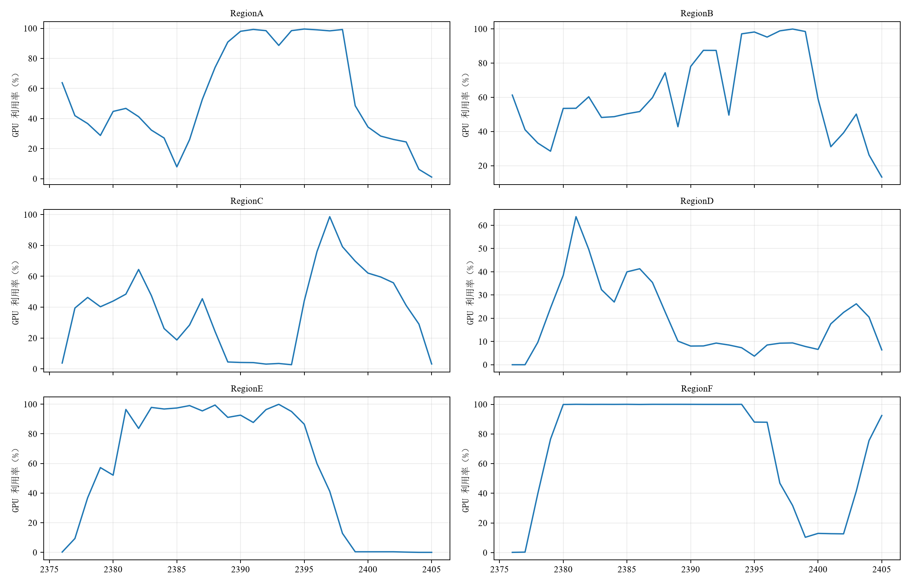

# 问题二：碳感知 AI 工作负载调度分析报告

> 数据来源：`workload_trace.xlsx`（50,000 条任务轨迹）、`GPU_information.xlsx`、`network_latency.xlsx`、`power_mapping.xlsx`、`region_time_data.xlsx`。  
> 建模依据：题目正文与 [t2_plan.md](t2_plan.md)。本报告严格采用计划中定义的能源平衡、C1—C8 约束、`C + λE` 目标函数与两阶段分层求解逻辑，不扩展未实现的储能、潮流、带宽、传输能耗或传输费用模型。  
> 结果口径：采用 `output_merged/`。该目录以 CPU 版完整四方案结果为骨架，并合并 GPU 版 Lambda 灵敏度结果；其中调度、能源平衡及约束验证结果均以合并后的 CSV 为准。

---

## 1. 问题理解与研究边界

题目二要求以第 0—2399 小时实际到达的 AI 任务和区域逐时电力参数为输入，综合考虑区域电价、碳强度与可用新能源出力，以**任务执行区域**和**整数开工时刻**为决策变量，形成碳感知任务调度策略。迁移后的设施负荷需按统一功率映射与区域 PUE 重新计算，并评价运行成本、碳排放、网络时延及新能源利用率。

时域和任务边界严格遵从题意：

- 第 0—2399 小时为主运行时域；
- 第 2400—2405 小时不产生新任务，只用于结清尾部弹性任务，且计入能源、成本和碳排结算；
- 第 2406 小时不安排未完成任务，仅用于能源结算；
- 任务不可拆分、不可抢占、不可中途迁移；
- 实时推理任务到达即开工；批量推理和 AI 训练任务允许延后，但必须在时点 2406 前完成。

问题二不引入储能决策。储能充放电、SOC 和终端 SOC 约束属于问题三，故不进入本报告的模型。

| 区域 | 题目定位 | 调度含义 |
|---|---|---|
| RegionA、RegionB、RegionC | 东部高负荷区域 | 优先保障低时延实时业务 |
| RegionD | 西部算力中心 | 承接可迁移的批量推理与训练负荷 |
| RegionE | 光伏资源富集区域 | 适合低碳与日间新能源消纳分析 |
| RegionF | 风电资源富集区域 | 适合风电时段负荷匹配分析 |

---

## 2. 数据事实、符号与统一核算口径

### 2.1 影响模型形态的关键数据事实

依据 `t2_plan.md` 的数据核查，问题二具有以下三个直接影响建模方式的事实。

1. **时延按任务类型严格分档。** 实时推理、批量推理和 AI 训练的时延阈值分别为 20 ms、80 ms 与 150 ms。因此，实时任务的可达区域很小；批量任务在 80 ms 下几乎全连通，仅 `RegionA→RegionF` 与 `RegionF→RegionA` 的 82 ms 链路不可达；训练任务在六区域内均可达。这构成实时、批量、训练三类任务的柔性差异。
2. **电价与碳强度区域同向。** 二者相关系数为 0.578。计划文件给出的区域均值中，RegionA 的电价、碳强度最高（708 元/MWh、0.620 tCO2/MWh），RegionE 最低（374 元/MWh、0.220 tCO2/MWh）。同时碳强度按小时变化，形成“区域—时刻”联合优化空间。
3. **可再生能源长期过剩。** 所有区域、所有小时的 `AvailableRenewable_MW` 均不低于 500 MW，而基准设施负荷最高为 651 MW。按附件要求的“可再生优先、购电仅补缺口”口径，优化后购电可趋近于 0。因此，必须将“可再生优先消纳”带来的口径收益与“迁移/时刻优化”带来的边际收益分开报告。

### 2.2 符号与决策变量

沿用问题一的任务参数：任务 `i` 的到达时刻为 `a_i`，运行时长为 `d_i`，GPU 需求为 `g_i`，来源区域为 `σ_i`，最大可接受时延为 `L_i`，最晚完成时刻为 `f_i`。区域 `r` 的可用 GPU 容量、IT 功率上限、PUE 与非 AI IT 负荷分别记为 `G_r`、`M_r`、`P_r`、`N_r(t)`。

新增能源参数如下。

| 符号 | 含义 | 单位 |
|---|---|---|
| `ρ_r(t)` | 购电价 | 元/MWh |
| `ξ_r(t)` | 碳强度 | tCO2/MWh |
| `R_r(t)` | 可用新能源出力 | MW |
| `φ_r(t)` | 售电价 | 元/MWh |
| `S_r` | 外送上限 | MW |

核心决策变量为：

- `x_{i,r} ∈ {0,1}`：任务 `i` 是否在区域 `r` 执行；
- `s_i ∈ Z`：任务 `i` 的整数开工时刻；
- `y(r,t)`：富余新能源外送量。该变量可由富余新能源与区域外送上限直接确定，不作为核心搜索变量。

### 2.3 分钟级重叠与负荷映射

为避免非整小时任务被粗略取整，任务 `i` 在小时 `t` 内的实际运行时长定义为：

```text
o(i,t) = max(0, min(t+1, s_i+d_i) − max(t, s_i)),    0 ≤ o(i,t) ≤ 1
```

由 `power_mapping.xlsx` 中任务类型单位等效 GPU 功率 `p_{τ_i}`，计算区域逐时 AI IT 负荷：

```text
AI_IT_Load(r,t) = Σ_i g_i · p_{τ_i} · o(i,t) · x_{i,r}
IT_Load(r,t) = N_r(t) + AI_IT_Load(r,t)
Total_Load(r,t) = IT_Load(r,t) · P_r
```

其中 `Total_Load(r,t)` 为设施侧总负荷。该链条与题目“迁移后的设施负荷按统一功率映射和区域 PUE 计算”的要求一致。

---

## 3. 能源平衡、约束体系与优化目标

### 3.1 无储能能源平衡与可再生优先决策

问题二无储能，任一地区、任一小时满足：

```text
GridPurchase(r,t) + R_r(t)
= Total_Load(r,t) + GridSell(r,t) + Curtailment(r,t)
```

可再生能源免费且零碳，因此对给定的设施负荷，最优供能决策可解析写为：

```text
直接消纳：a(r,t) = min(R_r(t), Total_Load(r,t))
购电：    q(r,t) = max(0, Total_Load(r,t) − R_r(t))
外送：    y(r,t) = min(S_r, R_r(t) − Total_Load(r,t))
弃电：    w(r,t) = R_r(t) − a(r,t) − y(r,t)
```

全时域运行成本与碳排放为：

```text
C = Σ_{r,t} [q(r,t) · ρ_r(t) − y(r,t) · φ_r(t)]
E = Σ_{r,t} q(r,t) · ξ_r(t)
```

在可再生长期富余的数据条件下，调度的边际价值主要来自避免少数 `R_r(t) < Total_Load(r,t)` 的紧张时段、调整可外送区域与不可外送区域之间的负荷分布，以及减少弃电。需要特别说明：运行成本允许为负，因为式中的外送收入以负项计入；负成本表示外送收入超过购电支出，并不表示系统产生了负能耗。

售电价 `φ_r(t)` 不是本文自行假设，而是直接读取 `region_time_data.xlsx` 的 `SellPrice_CNY_per_MWh` 字段。原始数据中 RegionA、RegionB、RegionC 的售电价及外送上限均为 0；RegionD、RegionE、RegionF 允许外送，其售电价分别处于 207.11—510.48、183.03—451.12、192.66—474.86 元/MWh。由于新能源按题目口径免费且外送收入为正，满足本地负荷后会优先在外送上限内售电，剩余部分才计为弃电。因此，后续必须将购电支出与外送收入拆开解释，不能只展示净运行成本。

### 3.2 约束体系 C1—C8

| 编号 | 约束 | 数学表达 |
|---|---|---|
| C1 | 唯一指派 | `Σ_r x_{i,r} = 1` |
| C2 | 实时任务固定本地 | `s_i = a_i` 且 `x_{i,σ_i}=1` |
| C3 | 网络时延 SLA | `Σ_r D_{σ_i,r}·x_{i,r} ≤ L_i` |
| C4 | 到达与完成时限 | `s_i ≥ a_i`，`s_i+d_i ≤ f_i` |
| C5 | GPU 容量 | `Σ_i g_i·o(i,t)·x_{i,r} ≤ G_r` |
| C6 | IT 功率容量 | `Σ_i g_i·p_{τ_i}·o(i,t)·x_{i,r} ≤ M_r−N_r(t)` |
| C7 | 第 2406 小时边界 | `s_i+d_i ≤ 2406` |
| C8 | 购售电边界 | `0 ≤ y(r,t) ≤ S_r`，`q(r,t) ≥ 0` |

其中，C3 先构造可达区域集 `R_i={r:D_{σ_i,r}≤L_i}`，从源头剔除违反 SLA 的区域。输入数据已经校验 `Max_Facility_Power_MW = Max_IT_Power_MW × PUE`，因此 IT 功率约束与 PUE 映射共同保证设施侧功率口径一致。

### 3.3 目标函数与评价指标

使用碳价折算的单目标函数：

```text
min F(x,s) = C + λ · E
```

其中 `λ` 为碳价（元/tCO2），主方案取 `λ=200`，并在 `λ∈{0,50,100,150,200,300,500}` 下开展灵敏度计算。计划文件还给出了补充性的 ε-约束双目标表达：在 `E≤Ē` 下最小化 `C`，用于说明成本—碳排前沿；由于电价与碳强度同向，预期前沿较窄，不人为构造复杂帕累托解。

评价指标包括：运行成本、碳排放、GPU-hour 加权平均时延、最大时延、新能源利用率、迁移数、迁移率和弹性任务平均等待时间。

---

## 4. 两阶段分层求解方法

### 4.1 阶段一：区域粗指派

对于每个弹性任务 `i`，先根据 C3 得到候选区域 `r∈R_i`，再以区域平均能源成本构造吸引力：

```text
score(i,r) = (ρ̄_r + λ·ξ̄_r) · g_i · p_τ · P_r · d_i
```

阶段一受以下条件约束：

- C3 时延可达性预剪枝；
- 粗粒度容量松弛 `Σ_i g_i·d_i·x_{i,r} ≤ G_r·H_avail(r)`；
- C2：实时任务本地固定。

实现中，弹性任务按 GPU-hour 从大到小、最晚开工时刻从早到晚排序；候选区域按平均电价与碳价折算后的能源代价排序，并以粗容量松弛避免过度集中。此阶段只提供初始区域偏好，并不追求最终最优；细化由阶段二完成。

### 4.2 阶段二：EDF 时刻选择与局部重指派

任务按 EDF 原则处理。具体顺序为：实时任务优先、最晚开工时刻升序、GPU 需求降序、到达时刻升序。

- 实时推理任务：固定在来源区域，于到达时刻开工；
- 弹性任务：在 `[a_i, f_i−d_i]` 的整数开工时刻内枚举，并允许在全部 SLA 可达区域内重新选择。

对每个候选“区域—时刻”，程序按照分钟级重叠量：

1. 检查 C5 的 GPU 容量；
2. 检查 C6 的 AI IT 功率余量；
3. 计算加入任务前后的设施侧目标变化；
4. 以边际目标 `ΔF` 最小的候选作为执行方案。

候选的边际成本同时体现可再生优先、购电成本、外送收入、碳强度、PUE 和碳价。阶段一的首选区域只在近似并列的方案中发挥稳定排序作用，阶段二仍允许向其他 SLA 可达区域重指派。

`t2_plan.md` 将滚动时域方法列为对照方案：窗口 `W≥72 h`，每次只提交前 24 小时决策。当前 `output_merged` 中未提供滚动时域的独立结果，因此本文不将滚动时域写为已完成实验。

---

## 5. 对照方案与三级归因口径

| 方案 | 区域决策 | 开工时刻决策 | 作用 |
|---|---|---|---|
| AttachmentBaseline | 题目既有状态 | 题目既有状态 | 直接读取附件基准购售电、碳排和弃电 |
| Q1Schedule_Recalculated | 不迁移，保持来源区域 | 沿用问题一调度时刻，平均弹性等待仅 0.0039 h | 作为“不迁移、不进行能源导向调时”的纯算力基准，并按问题二能源口径重算 |
| 方案 A | 不迁移，强制固定来源区域 | 在本地区域内按边际能源目标重新选择整数开工时刻 | 隔离**能源导向时刻优化**的贡献 |
| 方案 B | 允许在 SLA 可达区域间迁移 | 同时按边际能源目标选择区域与整数开工时刻 | 在方案 A 基础上隔离**跨区迁移**的增量贡献 |
| Lambda 灵敏度 | 与方案 B 相同 | 与方案 B 相同 | 检查不同碳价权重是否改变调度结果 |

上述定义与程序实现一致：方案 A 调用与方案 B 相同的 EDF 和候选开工时刻枚举，只是 `local_only=True` 将每个任务的候选区域限制为来源区域；因此方案 A 并非“只改变供能口径”，而是“不迁移但允许能源导向调时”。据此采用三级归因：

1. **附件基准 → Q1 重算**：包含附件既有状态与问题一纯算力调度之间的综合差异，不单独归因于问题二优化；
2. **Q1 重算 → 方案 A**：两者均不迁移，差额归因于本地区域内的能源导向开工时刻优化；
3. **方案 A → 方案 B**：两者均执行可再生优先和能源导向调时，差额归因于开放跨区迁移所带来的增量效果。

---

## 6. 调度结果与分析

### 6.1 四方案综合指标

| 方案 | 运行成本（元） | 碳排（tCO2） | 购电（MWh） | 外送（MWh） | 弃电（MWh） | 迁移数 | 加权平均/最大时延（ms） | 弹性任务平均等待（h） |
|---|---:|---:|---:|---:|---:|---:|---:|---:|
| AttachmentBaseline | 1,250,567,376.93 | 2,045,367.48 | 3,129,066.75 | 1,375,256.18 | 7,754,925.75 | — | — | — |
| Q1Schedule_Recalculated | −419,806,051.38 | 8.85 | 31.5978667 | 1,330,219.91 | 3,706,113.15 | 0 | 5.00 / 5.00 | 0.0039 |
| 方案 A：不迁移、能源导向调时 | −452,925,719.22 | 0.00 | **0（精确值）** | 1,464,044.68 | 3,572,256.77 | 0 | 5.00 / 5.00 | 1.2473 |
| 方案 B：迁移与调时联合优化 | −453,074,317.86 | 0.00 | **0（精确值）** | 1,464,718.64 | 3,569,498.21 | 28,660 | 37.50 / 82.00 | 30.8971 |


方案 A、B 的逐区域逐小时能源平衡文件中，`GridPurchase_MW` 的非零记录数均为 0，最大值也为 0，因此表中的购电量不是四舍五入结果。程序确实通过调时以及区域—时刻联合选择，使全部 AI 负荷保持在逐时可再生包络内。Q1 重算仍有 31.5978667 MWh 购电，说明原纯算力调度在少数紧张小时突破了该包络。

### 6.2 三级归因结果

| 对比 | 成本改善（元） | 购电变化（MWh） | 外送变化（MWh） | 弃电变化（MWh） | 碳排变化（tCO2） | 等待时间变化（h） | 归因 |
|---|---:|---:|---:|---:|---:|---:|---|
| Q1 重算 → 方案 A | 33,119,667.84 | −31.5978667 | +133,824.78 | −133,856.38 | −8.85 | +1.2434 | 不迁移条件下的能源导向调时 |
| 方案 A → 方案 B | 148,598.64 | 0 | +673.95 | −2,758.57 | 0 | +29.6498 | 开放跨区迁移的增量效果 |

这组差额修正了归因关系：方案 A 已经包含开工时刻优化，因此 A→B 不能再解释为“迁移及开工时刻优化”的共同贡献，而只能解释为在相同调时规则下开放跨区迁移的贡献。新能源利用率从方案 A 的 69.0734% 升至方案 B 的 69.0973%，仅增加 0.0239 个百分点；由于总可再生量分母很大，该相对指标只作为辅助结果，主要收益证据采用弃电减少 2,758.57 MWh 和外送增加 673.95 MWh。

### 6.3 负运行成本与购售电拆解

| 方案 | 购电支出（元） | 外送收入（元） | 净运行成本（元） | 成本形成机制 |
|---|---:|---:|---:|---|
| Q1 重算 | 8,215.45 | 419,814,266.82 | −419,806,051.38 | 外送收入远高于少量购电支出 |
| 方案 A | 0.00 | 452,925,719.22 | −452,925,719.22 | 无购电，净成本等于外送收入的相反数 |
| 方案 B | 0.00 | 453,074,317.86 | −453,074,317.86 | 无购电，迁移后外送收入略有增加 |

负运行成本完全由 `C=购电支出−外送收入` 的定义产生。外送收入所用售电价来自原始附件字段，并非另行设定；模型也没有把弃电直接出售，只有 RegionD、RegionE、RegionF 在各自外送上限内的 `GridSell_MW` 才计入收入。当前数据允许免费新能源在满足本地负荷后外送获利，因此净成本呈现较大的负值。这个结果高度依赖题目给定的免费新能源、售电价和外送上限口径；若现实中考虑新能源利用成本、并网约束或结算折价，负成本绝对值会相应缩小。

### 6.4 迁移结构、能源信号退化与反向流向

| 任务类型 | 总任务数 | 迁移任务数 | 迁移率 | 平均等待时间（h） |
|---|---:|---:|---:|---:|
| RealTimeInference | 16,724 | 0 | 0.000% | 0.0000 |
| BatchInference | 16,717 | 15,078 | 90.196% | 24.2960 |
| AITraining | 16,559 | 13,582 | 82.022% | 37.5612 |
| 合计 | 50,000 | 28,660 | 57.320% | 弹性任务 30.8971 |


实时推理任务迁移数为 0，说明 C2 的本地即时执行要求得到严格保持。批量推理迁移率高于 AI 训练并不表示其理论可达域更大；训练任务仍具有六区全连通的最大区域柔性。进一步核查发现，批量推理与 AI 训练的平均持续时间分别为 3.4035 h 和 3.4084 h，差异很小，因此不能简单归因于“批量任务更短”。更稳妥的解释是：实际迁移率由每个任务的 GPU 需求、截止窗口、来源区域、EDF 处理顺序以及处理当时的剩余 GPU/IT 容量共同决定；现有汇总输出不足以把 8 个百分点的差异唯一归因于某一个因素。因此，这一结果应理解为构造式贪心算法在具体任务序列和容量状态下形成的结果，而不是三级 SLA 柔性的单调映射。

按迁移 GPU-hour 计算，较大的跨区流向包括：

| 来源区 → 执行区 | 迁移任务数 | 迁移 GPU-hour |
|---|---:|---:|
| RegionD → RegionE | 943 | 509,296.68 |
| RegionD → RegionF | 4,349 | 508,035.82 |
| RegionF → RegionE | 732 | 396,904.47 |
| RegionE → RegionF | 3,006 | 354,941.98 |
| RegionD → RegionA | 2,161 | 288,835.67 |

其中 `RegionD→RegionA` 看似与“向低价低碳区域迁移”的直觉相反。核查调度明细后，这 2,161 个任务的平均等待仅 0.0014 h，说明它们大多被立即放入 RegionA 的可行容量窗口。原因在于方案 B 已实现全时域购电为 0，故 `λE` 项完全消失；当任务加入前后均未触发购电，且没有改变可外送电量或相关候选的边际目标近似并列时，阶段二的选择主要由 GPU/IT 容量可行性、EDF 顺序、阶段一偏好及确定性并列规则决定，而非由电价和碳强度直接驱动。因此，28,660 次迁移不能全部解释为能源信号驱动，其中相当部分是容量与时序约束下的副产品。

### 6.5 迁移收益与服务代价权衡

| 指标 | 方案 A | 方案 B | B 相对 A |
|---|---:|---:|---:|
| 成本（元） | −452,925,719.22 | −453,074,317.86 | 改善 148,598.64 |
| 迁移任务数 | 0 | 28,660 | +28,660 |
| 加权平均时延（ms） | 5.00 | 37.50 | +32.50 |
| 最大时延（ms） | 5.00 | 82.00 | +77.00 |
| 弹性任务平均等待（h） | 1.2473 | 30.8971 | +29.6498 |
| 外送（MWh） | 1,464,044.68 | 1,464,718.64 | +673.95 |
| 弃电（MWh） | 3,572,256.77 | 3,569,498.21 | −2,758.57 |

方案 B 相对方案 A 的成本改善仅占方案 A 外送收入的约 0.0328%，平均到每个迁移任务约 5.18 元；与此同时，加权平均时延由 5.00 ms 增至 37.50 ms，弹性任务平均等待增加 29.65 h。虽然所有任务仍满足 SLA 和截止时间，但从“收益—服务代价”角度看，当前迁移强度的性价比较低。若将时延、等待时间或迁移管理成本纳入目标函数，最优迁移数量预计会明显下降；当前结果更适合作为“无迁移成本约束下的能源收益上界”，而不是直接的工程部署策略。

### 6.6 全时域 GPU 利用率与尾部图说明



图 3 只展示 2376—2405 小时，是为了检查主时域结束后的尾部结清过程以及 C7 边界附近是否出现容量越界，并不代表模型只优化这 30 小时。下表的平均值和峰值均由 `scheme_b_hourly_usage.csv` 的完整 0—2406 小时汇总得到：

| 区域 | 全时域平均 GPU 利用率 | 全时域峰值 GPU 利用率 |
|---|---:|---:|
| RegionA | 62.13% | 100.00% |
| RegionB | 32.80% | 99.91% |
| RegionC | 16.24% | 98.63% |
| RegionD | 8.34% | 66.96% |
| RegionE | 61.70% | 100.00% |
| RegionF | 69.13% | 100.00% |

RegionD 平均利用率最低并非容量违规，而是其 GPU 容量较大、平均利用率分母更高，同时方案 B 的目标在购电为 0 后不会因“西部算力中心”标签而主动填满 RegionD；任务还会受外送收入、可再生包络、EDF 顺序和候选容量窗口影响。RegionA、RegionE、RegionF 的个别小时接近容量上界，但 C5、C6 均为 0 违规。

### 6.7 Lambda 灵敏度与目标退化

| λ（元/tCO2） | 运行成本（元） | 碳排（tCO2） | 迁移任务数 | 新能源利用率 |
|---:|---:|---:|---:|---:|
| 0 | −453,074,317.86 | 0.00 | 28,660 | 69.097% |
| 50 | −453,074,317.86 | 0.00 | 28,660 | 69.097% |
| 100 | −453,074,317.86 | 0.00 | 28,660 | 69.097% |
| 150 | −453,074,317.86 | 0.00 | 28,660 | 69.097% |
| 200 | −453,074,317.86 | 0.00 | 28,660 | 69.097% |
| 300 | −453,074,317.86 | 0.00 | 28,660 | 69.097% |
| 500 | −453,074,317.86 | 0.00 | 28,660 | 69.097% |

`λ=0` 至 `λ=500` 的结果完全相同。方案 B 所有逐时购电记录均为 0，故 `E=0`，目标中的 `λE` 项完全退化，碳价不再影响候选排序。但“购电为 0”不等于所有候选的边际成本都必然为 0：如果新增负荷减少了有正售电价区域的外送量，仍会产生放弃售电收入的正边际成本。只有在售电价为 0、外送上限已饱和，或多个候选对外送收入影响相同的情况下，候选才会出现零成本或近似并列。当前大量迁移以及 D→A 等反向流向表明，能源信号在很多候选之间缺乏足够区分度，EDF、容量状态和并列规则成为重要决定因素。

该现象与 `t2_plan.md` 中“可再生长期过剩、成本与碳排区域同向、帕累托前沿较窄”的判断一致。若后续需要增强能源信号，可按计划文件提出的方向对可再生消纳设置物理上限 `α` 或加入利用成本；若用于工程部署，还应显式加入迁移成本、时延或等待惩罚。但这些均不属于当前主结果的既定模型口径。

---

## 7. 约束验证

| 方案 | C1 唯一指派 | C2 实时本地即时 | C3 时延 SLA | C4 截止时限 | C5 GPU 容量 | C6 IT 功率 | C7 不占 2406 |
|---|---:|---:|---:|---:|---:|---:|---:|
| 方案 A | 0 | 0 | 0 | 0 | 0 | 0 | 0 |
| 方案 B | 0 | 0 | 0 | 0 | 0 | 0 | 0 |

两种方案均完成 `50,000 / 50,000` 个任务。程序化复核表明：每个任务均被唯一安排；实时任务保持本地即时执行；网络时延、到达/截止时限、逐时 GPU 容量、IT 功率容量和第 2406 小时边界均通过验证。

---

## 8. 主要结论与适用边界

1. **模型链条完整且归因已拆分。** 问题二将任务区域与开工时刻决策，通过“任务放置→AI IT 功率→设施侧负荷→新能源/电网平衡→成本与碳排放”统一起来，并在 C1—C8 约束下最小化 `C+λE`。Q1→A 用于度量本地调时贡献，A→B 用于度量开放迁移的增量贡献。
2. **负成本来自附件给定的外送收入。** Q1、方案 A、方案 B 的外送收入均超过购电支出；方案 A、B 购电为逐时精确 0，净运行成本分别等于外送收入的相反数。该结果依赖免费新能源、给定售电价和外送上限口径。
3. **时刻优化是主要可识别改善。** Q1 重算到方案 A 在不迁移条件下降低成本 33,119,667.84 元、消除 31.5978667 MWh 购电并减少 8.85 tCO2 碳排，代价是弹性任务平均等待增加 1.2434 h。
4. **迁移的边际性价比较低。** 方案 B 相比方案 A 仅降低成本 148,598.64 元、增加外送 673.95 MWh、减少弃电 2,758.57 MWh，却迁移 28,660 个任务，使加权平均时延增至 37.50 ms、弹性任务平均等待增至 30.8971 h；新能源利用率的 0.0239 个百分点增幅仅作辅助指标。
5. **迁移并非全部由能源信号驱动。** 购电为 0 使碳价项完全退化，许多候选之间的能源边际目标缺乏区分度，EDF、GPU/IT 容量、阶段一偏好和并列规则显著影响最终流向；D→A 等反向迁移属于这一机制的直接表现。
6. **迁移结构受可达域与任务形态共同决定。** 实时任务保持 0 迁移；批量迁移率高于训练，不能仅按 SLA 柔性解释，还与任务持续时间、截止窗口和贪心调度时的剩余容量有关。
7. **模型边界明确。** 本报告未引入储能、SOC、跨区潮流、网络带宽、迁移数据量、传输能耗、传输费用以及时延/等待惩罚；滚动时域和 ε-约束双目标仅作为 `t2_plan.md` 的对照或补充设计，未被表述为已完成实验。

---

## 9. 输出文件说明

本报告基于以下文件形成：

- `output_merged/reports/scenario_comparison.csv`：附件基准、Q1 重算、方案 A、方案 B 的四方案指标；
- `output_merged/reports/lambda_sensitivity.csv`：Lambda 灵敏度结果；
- `output_merged/reports/migration_marginal_contribution.csv`：方案 B 相对方案 A 的边际贡献；
- `output_merged/schedule/constraint_verification.csv`：C1—C7 程序化验证；
- `output_merged/schedule/scheme_b_carbon_aware_schedule.csv`：方案 B 任务调度明细；
- `output_merged/schedule/scheme_b_hourly_usage.csv`：方案 B 逐时 GPU 和 IT 使用情况；
- `output_merged/plots/`：本报告内嵌引用的三张图。
