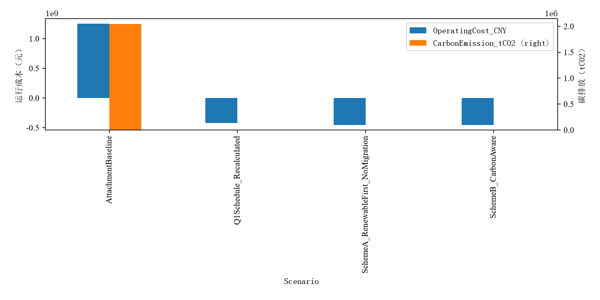
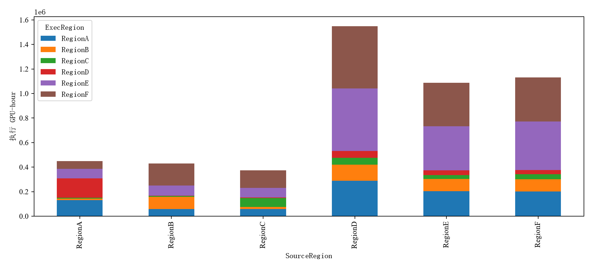
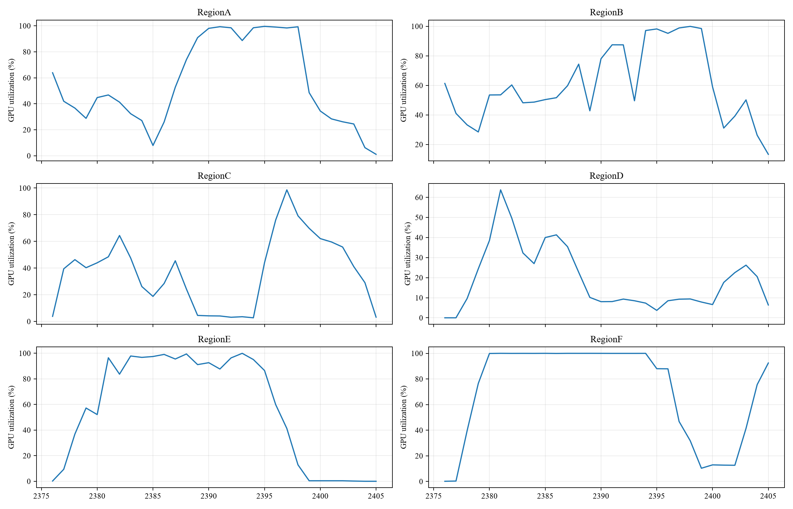

# 问题二：碳感知 AI 工作负载调度分析报告

> 数据来源：`workload_trace.xlsx`（50,000 条任务轨迹）、`GPU_information.xlsx`、`network_latency.xlsx`、`power_mapping.xlsx`、`region_time_data.xlsx`。  
> 建模依据：题目正文与 [t2_plan.md](t2_plan.md)。本报告严格采用计划中定义的能源平衡、C1—C8 约束、`C + λE` 目标函数与两阶段分层求解逻辑，不扩展未实现的储能、潮流、带宽、传输能耗或传输费用模型。  
> 结果口径：采用 `output_merged/`。该目录以 CPU 版完整四方案结果为骨架，并合并 GPU 版 Lambda 灵敏度结果；其中调度、能源平衡及约束验证结果均以合并后的 CSV 为准。

---

## 1. 问题理解与研究边界

题目二要求以第 0—2399 小时实际到达的 AI 任务和区域逐时电力参数为输入，综合考虑区域电价、碳强度与可用新能源出力，以**任务执行区域**和**整数开工时刻**为决策变量，形成碳感知任务调度策略。迁移后的设施负荷需按统一功率映射与区域 PUE 重新计算，并评价运行成本、碳排放、网络时延及新能源利用率。

时域和任务边界严格遵从题意：

- 第 0—2399 小时为主运行时域；
- 第 2400—2405 小时不产生新任务，只用于结清尾部弹性任务，且计入能源、成本和碳排结算；
- 第 2406 小时不安排未完成任务，仅用于能源结算；
- 任务不可拆分、不可抢占、不可中途迁移；
- 实时推理任务到达即开工；批量推理和 AI 训练任务允许延后，但必须在时点 2406 前完成。

问题二不引入储能决策。储能充放电、SOC 和终端 SOC 约束属于问题三，故不进入本报告的模型。

| 区域 | 题目定位 | 调度含义 |
|---|---|---|
| RegionA、RegionB、RegionC | 东部高负荷区域 | 优先保障低时延实时业务 |
| RegionD | 西部算力中心 | 承接可迁移的批量推理与训练负荷 |
| RegionE | 光伏资源富集区域 | 适合低碳与日间新能源消纳分析 |
| RegionF | 风电资源富集区域 | 适合风电时段负荷匹配分析 |

---

## 2. 数据事实、符号与统一核算口径

### 2.1 影响模型形态的关键数据事实

依据 `t2_plan.md` 的数据核查，问题二具有以下三个直接影响建模方式的事实。

1. **时延按任务类型严格分档。** 实时推理、批量推理和 AI 训练的时延阈值分别为 20 ms、80 ms 与 150 ms。因此，实时任务的可达区域很小；批量任务在 80 ms 下几乎全连通，仅 `RegionA→RegionF` 与 `RegionF→RegionA` 的 82 ms 链路不可达；训练任务在六区域内均可达。这构成实时、批量、训练三类任务的柔性差异。
2. **电价与碳强度区域同向。** 二者相关系数为 0.578。计划文件给出的区域均值中，RegionA 的电价、碳强度最高（708 元/MWh、0.620 tCO2/MWh），RegionE 最低（374 元/MWh、0.220 tCO2/MWh）。同时碳强度按小时变化，形成“区域—时刻”联合优化空间。
3. **可再生能源长期过剩。** 所有区域、所有小时的 `AvailableRenewable_MW` 均不低于 500 MW，而基准设施负荷最高为 651 MW。按附件要求的“可再生优先、购电仅补缺口”口径，优化后购电可趋近于 0。因此，必须将“可再生优先消纳”带来的口径收益与“迁移/时刻优化”带来的边际收益分开报告。

### 2.2 符号与决策变量

沿用问题一的任务参数：任务 `i` 的到达时刻为 `a_i`，运行时长为 `d_i`，GPU 需求为 `g_i`，来源区域为 `σ_i`，最大可接受时延为 `L_i`，最晚完成时刻为 `f_i`。区域 `r` 的可用 GPU 容量、IT 功率上限、PUE 与非 AI IT 负荷分别记为 `G_r`、`M_r`、`P_r`、`N_r(t)`。

新增能源参数如下。

| 符号 | 含义 | 单位 |
|---|---|---|
| `ρ_r(t)` | 购电价 | 元/MWh |
| `ξ_r(t)` | 碳强度 | tCO2/MWh |
| `R_r(t)` | 可用新能源出力 | MW |
| `φ_r(t)` | 售电价 | 元/MWh |
| `S_r` | 外送上限 | MW |

核心决策变量为：

- `x_{i,r} ∈ {0,1}`：任务 `i` 是否在区域 `r` 执行；
- `s_i ∈ Z`：任务 `i` 的整数开工时刻；
- `y(r,t)`：富余新能源外送量。该变量可由富余新能源与区域外送上限直接确定，不作为核心搜索变量。

### 2.3 分钟级重叠与负荷映射

为避免非整小时任务被粗略取整，任务 `i` 在小时 `t` 内的实际运行时长定义为：

```text
o(i,t) = max(0, min(t+1, s_i+d_i) − max(t, s_i)),    0 ≤ o(i,t) ≤ 1
```

由 `power_mapping.xlsx` 中任务类型单位等效 GPU 功率 `p_{τ_i}`，计算区域逐时 AI IT 负荷：

```text
AI_IT_Load(r,t) = Σ_i g_i · p_{τ_i} · o(i,t) · x_{i,r}
IT_Load(r,t) = N_r(t) + AI_IT_Load(r,t)
Total_Load(r,t) = IT_Load(r,t) · P_r
```

其中 `Total_Load(r,t)` 为设施侧总负荷。该链条与题目“迁移后的设施负荷按统一功率映射和区域 PUE 计算”的要求一致。

---

## 3. 能源平衡、约束体系与优化目标

### 3.1 无储能能源平衡与可再生优先决策

问题二无储能，任一地区、任一小时满足：

```text
GridPurchase(r,t) + R_r(t)
= Total_Load(r,t) + GridSell(r,t) + Curtailment(r,t)
```

可再生能源免费且零碳，因此对给定的设施负荷，最优供能决策可解析写为：

```text
直接消纳：a(r,t) = min(R_r(t), Total_Load(r,t))
购电：    q(r,t) = max(0, Total_Load(r,t) − R_r(t))
外送：    y(r,t) = min(S_r, R_r(t) − Total_Load(r,t))
弃电：    w(r,t) = R_r(t) − a(r,t) − y(r,t)
```

全时域运行成本与碳排放为：

```text
C = Σ_{r,t} [q(r,t) · ρ_r(t) − y(r,t) · φ_r(t)]
E = Σ_{r,t} q(r,t) · ξ_r(t)
```

在可再生长期富余的数据条件下，调度的边际价值主要来自避免少数 `R_r(t) < Total_Load(r,t)` 的紧张时段、提高新能源利用率以及减少弃电；不能把相对附件基准的大幅成本/碳排改善全部归因于任务迁移。

### 3.2 约束体系 C1—C8

| 编号 | 约束 | 数学表达 |
|---|---|---|
| C1 | 唯一指派 | `Σ_r x_{i,r} = 1` |
| C2 | 实时任务固定本地 | `s_i = a_i` 且 `x_{i,σ_i}=1` |
| C3 | 网络时延 SLA | `Σ_r D_{σ_i,r}·x_{i,r} ≤ L_i` |
| C4 | 到达与完成时限 | `s_i ≥ a_i`，`s_i+d_i ≤ f_i` |
| C5 | GPU 容量 | `Σ_i g_i·o(i,t)·x_{i,r} ≤ G_r` |
| C6 | IT 功率容量 | `Σ_i g_i·p_{τ_i}·o(i,t)·x_{i,r} ≤ M_r−N_r(t)` |
| C7 | 第 2406 小时边界 | `s_i+d_i ≤ 2406` |
| C8 | 购售电边界 | `0 ≤ y(r,t) ≤ S_r`，`q(r,t) ≥ 0` |

其中，C3 先构造可达区域集 `R_i={r:D_{σ_i,r}≤L_i}`，从源头剔除违反 SLA 的区域。输入数据已经校验 `Max_Facility_Power_MW = Max_IT_Power_MW × PUE`，因此 IT 功率约束与 PUE 映射共同保证设施侧功率口径一致。

### 3.3 目标函数与评价指标

使用碳价折算的单目标函数：

```text
min F(x,s) = C + λ · E
```

其中 `λ` 为碳价（元/tCO2），主方案取 `λ=200`，并在 `λ∈{0,50,100,150,200,300,500}` 下开展灵敏度计算。计划文件还给出了补充性的 ε-约束双目标表达：在 `E≤Ē` 下最小化 `C`，用于说明成本—碳排前沿；由于电价与碳强度同向，预期前沿较窄，不人为构造复杂帕累托解。

评价指标包括：运行成本、碳排放、GPU-hour 加权平均时延、最大时延、新能源利用率、迁移数、迁移率和弹性任务平均等待时间。

---

## 4. 两阶段分层求解方法

### 4.1 阶段一：区域粗指派

对于每个弹性任务 `i`，先根据 C3 得到候选区域 `r∈R_i`，再以区域平均能源成本构造吸引力：

```text
score(i,r) = (ρ̄_r + λ·ξ̄_r) · g_i · p_τ · P_r · d_i
```

阶段一受以下条件约束：

- C3 时延可达性预剪枝；
- 粗粒度容量松弛 `Σ_i g_i·d_i·x_{i,r} ≤ G_r·H_avail(r)`；
- C2：实时任务本地固定。

实现中，弹性任务按 GPU-hour 从大到小、最晚开工时刻从早到晚排序；候选区域按平均电价与碳价折算后的能源代价排序，并以粗容量松弛避免过度集中。此阶段只提供初始区域偏好，并不追求最终最优；细化由阶段二完成。

### 4.2 阶段二：EDF 时刻选择与局部重指派

任务按 EDF 原则处理。具体顺序为：实时任务优先、最晚开工时刻升序、GPU 需求降序、到达时刻升序。

- 实时推理任务：固定在来源区域，于到达时刻开工；
- 弹性任务：在 `[a_i, f_i−d_i]` 的整数开工时刻内枚举，并允许在全部 SLA 可达区域内重新选择。

对每个候选“区域—时刻”，程序按照分钟级重叠量：

1. 检查 C5 的 GPU 容量；
2. 检查 C6 的 AI IT 功率余量；
3. 计算加入任务前后的设施侧目标变化；
4. 以边际目标 `ΔF` 最小的候选作为执行方案。

候选的边际成本同时体现可再生优先、购电成本、外送收入、碳强度、PUE 和碳价。阶段一的首选区域只在近似并列的方案中发挥稳定排序作用，阶段二仍允许向其他 SLA 可达区域重指派。

`t2_plan.md` 将滚动时域方法列为对照方案：窗口 `W≥72 h`，每次只提交前 24 小时决策。当前 `output_merged` 中未提供滚动时域的独立结果，因此本文不将滚动时域写为已完成实验。

---

## 5. 对照方案与结果口径

| 方案 | 作用 | 是否迁移 | 结果口径 |
|---|---|---|---|
| AttachmentBaseline | 题目提供的附件基准状态 | 题目既有状态 | 直接读取基准购售电、碳排和弃电 |
| Q1Schedule_Recalculated | 问题一纯算力调度的能源后果 | 0 | 依问题二统一功率与能源口径重新计算 |
| 方案 A | 可再生优先、不迁移的对照 | 否 | 隔离可再生优先消纳带来的口径收益 |
| 方案 B | 可再生优先+迁移+时刻优化的主方案 | 是 | 衡量碳感知调度的综合效果 |
| Lambda 灵敏度 | 碳价权重稳健性检验 | 是 | 仅比较不同 `λ` 的策略结果 |

**归因原则**：方案 A 与方案 B 的差额才表示迁移及开工时刻优化的边际贡献；附件基准到方案 A/B 的巨大差异中包含可再生优先消纳的共同口径变化，不能整体归因于任务调度。

---

## 6. 调度结果与分析

### 6.1 四方案指标对比

| 方案 | 运行成本（元） | 碳排（tCO2） | 新能源利用率 | 购电（MWh） | 迁移任务数 | 加权平均时延（ms） |
|---|---:|---:|---:|---:|---:|---:|
| AttachmentBaseline | 1,250,567,376.93 | 2,045,367.48 | 32.862% | 3,129,066.75 | — | — |
| Q1Schedule_Recalculated | −419,806,051.38 | 8.85 | 67.915% | 31.60 | 0 | 5.00 |
| 方案 A：可再生优先、不迁移 | −452,925,719.22 | 0.00 | 69.073% | 0.00 | 0 | 5.00 |
| 方案 B：碳感知调度 | −453,074,317.86 | 0.00 | 69.097% | 0.00 | 28,660 | 37.50 |



由表和图可见：

- 附件基准存在 3,129,066.75 MWh 购电以及 2,045,367.48 tCO2 碳排放，新能源利用率仅为 32.862%；
- 问题一调度按问题二口径重算后，购电已大幅减少；
- 方案 A 执行可再生优先后，购电降为 0，新能源利用率提高至 69.073%；因此从附件基准到方案 A 的改善，主要反映供能口径和可再生消纳策略的变化；
- 方案 B 在方案 A 基础上进一步降低运行成本 148,598.64 元，新能源利用率提高 **0.0239 个百分点**，外送电量增加 673.95 MWh，弃电减少 2,758.57 MWh。

方案 A 与方案 B 的购电均为 0、碳排均为 0，所以在当前数据下，迁移和时刻优化没有带来额外的碳排下降；其可识别收益主要表现为提高外送、减少弃电并带来较小的运行成本改善。

### 6.2 迁移结构与任务柔性

| 任务类型 | 总任务数 | 迁移任务数 | 迁移率 | 解释 |
|---|---:|---:|---:|---|
| RealTimeInference | 16,724 | 0 | 0.000% | 严格执行本地、到达即开工 |
| BatchInference | 16,717 | 15,078 | 90.196% | 80 ms SLA 下可达域较广，可参与区域与时刻优化 |
| AITraining | 16,559 | 13,582 | 82.022% | 150 ms SLA 下六区域全连通，柔性最强 |
| 合计 | 50,000 | 28,660 | 57.320% | 迁移仅发生于弹性任务 |



实时推理任务迁移数为 0，说明 C2 的本地即时执行要求得到严格保持。迁移集中于批量推理和训练任务，符合任务类型的时延敏感性差异。

按迁移 GPU-hour 计算，较大的跨区流向包括：

| 来源区 → 执行区 | 迁移任务数 | 迁移 GPU-hour |
|---|---:|---:|
| RegionD → RegionE | 943 | 509,296.68 |
| RegionD → RegionF | 4,349 | 508,035.82 |
| RegionF → RegionE | 732 | 396,904.47 |
| RegionE → RegionF | 3,006 | 354,941.98 |
| RegionD → RegionA | 2,161 | 288,835.67 |

这些流向体现了弹性任务在 SLA 可达、GPU/IT 功率可行的前提下，对区域和时刻边际能源目标的响应。

### 6.3 尾部时域 GPU 利用率与容量可行性



图 3 展示 2376—2405 小时结清时域的区域 GPU 利用率。由 `scheme_b_hourly_usage.csv` 汇总，峰值利用率如下。

| 区域 | 峰值 GPU 利用率 | 平均 GPU 利用率 |
|---|---:|---:|
| RegionA | 100.00% | 62.13% |
| RegionB | 99.91% | 32.80% |
| RegionC | 98.63% | 16.24% |
| RegionD | 66.96% | 8.34% |
| RegionE | 100.00% | 61.70% |
| RegionF | 100.00% | 69.13% |

RegionA、RegionE 和 RegionF 在个别小时接近容量上界，说明阶段二确实将部分柔性任务填入可行的容量窗口；但约束验证中 C5 和 C6 均为 0 违规，因此不存在 GPU 容量或 AI IT 功率越界。

### 6.4 Lambda 灵敏度

| λ（元/tCO2） | 运行成本（元） | 碳排（tCO2） | 迁移任务数 | 新能源利用率 |
|---:|---:|---:|---:|---:|
| 0 | −453,074,317.86 | 0.00 | 28,660 | 69.097% |
| 50 | −453,074,317.86 | 0.00 | 28,660 | 69.097% |
| 100 | −453,074,317.86 | 0.00 | 28,660 | 69.097% |
| 150 | −453,074,317.86 | 0.00 | 28,660 | 69.097% |
| 200 | −453,074,317.86 | 0.00 | 28,660 | 69.097% |
| 300 | −453,074,317.86 | 0.00 | 28,660 | 69.097% |
| 500 | −453,074,317.86 | 0.00 | 28,660 | 69.097% |

当前输出中，`λ=0` 至 `λ=500` 的结果完全相同。这并非缺少灵敏度计算，而是可再生长期富余使候选方案均满足 `q(r,t)=0`，进而得到 `E=0`；目标函数中的 `λE` 项不再改变候选方案排序。

该现象与 `t2_plan.md` 中“成本与碳排区域同向、帕累托前沿较窄”“调度价值集中于少数新能源不足小时”的判断一致。若后续需要稳健性扩展，可按计划文件提出的方向对可再生消纳设置物理上限 `α` 或加入利用成本；但这不属于当前主结果的模型口径。

---

## 7. 约束验证

| 方案 | C1 唯一指派 | C2 实时本地即时 | C3 时延 SLA | C4 截止时限 | C5 GPU 容量 | C6 IT 功率 | C7 不占 2406 |
|---|---:|---:|---:|---:|---:|---:|---:|
| 方案 A | 0 | 0 | 0 | 0 | 0 | 0 | 0 |
| 方案 B | 0 | 0 | 0 | 0 | 0 | 0 | 0 |

两种方案均完成 `50,000 / 50,000` 个任务。程序化复核表明：每个任务均被唯一安排；实时任务保持本地即时执行；网络时延、到达/截止时限、逐时 GPU 容量、IT 功率容量和第 2406 小时边界均通过验证。

---

## 8. 主要结论与适用边界

1. **模型链条完整。** 问题二将任务区域与开工时刻决策，通过“任务放置→AI IT 功率→设施侧负荷→新能源/电网平衡→成本与碳排放”统一起来，并在 C1—C8 约束下最小化 `C+λE`。
2. **可再生优先是主要改善来源。** 方案 A 已将购电和碳排降至 0，说明相对附件基准的大幅改善主要来自可再生优先消纳口径，不能全部归因于任务迁移。
3. **迁移的边际贡献有限但可量化。** 方案 B 相比方案 A 增加外送 673.95 MWh、减少弃电 2,758.57 MWh、降低运行成本 148,598.64 元，并使新能源利用率提高 0.0239 个百分点。
4. **迁移遵从任务柔性。** 28,660 个迁移任务全部来自批量推理和 AI 训练；实时推理保持 0 迁移，符合 C2 和三级 SLA 可达域结构。
5. **Lambda 敏感性不显著。** 当前数据下所有方案购电均为 0，故碳价从 0 到 500 元/tCO2 不改变调度结果。这一结论受可再生长期过剩的数据特征约束。
6. **模型边界明确。** 本报告未引入储能、SOC、跨区潮流、网络带宽、迁移数据量、传输能耗和传输费用；滚动时域和 ε-约束双目标仅作为 `t2_plan.md` 的对照/补充设计，因 `output_merged` 未提供相应独立结果，未被表述为已完成实验。

---

## 9. 输出文件说明

本报告基于以下文件形成：

- `output_merged/reports/scenario_comparison.csv`：附件基准、Q1 重算、方案 A、方案 B 的四方案指标；
- `output_merged/reports/lambda_sensitivity.csv`：Lambda 灵敏度结果；
- `output_merged/reports/migration_marginal_contribution.csv`：方案 B 相对方案 A 的边际贡献；
- `output_merged/schedule/constraint_verification.csv`：C1—C7 程序化验证；
- `output_merged/schedule/scheme_b_carbon_aware_schedule.csv`：方案 B 任务调度明细；
- `output_merged/schedule/scheme_b_hourly_usage.csv`：方案 B 逐时 GPU 和 IT 使用情况；
- `output_merged/plots/`：本报告内嵌引用的三张图。
